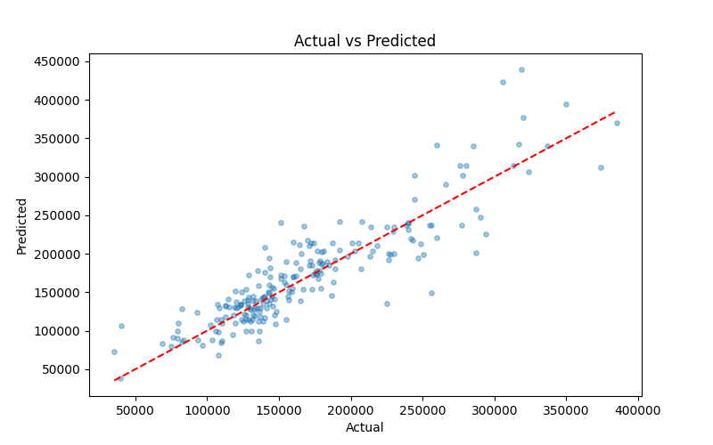
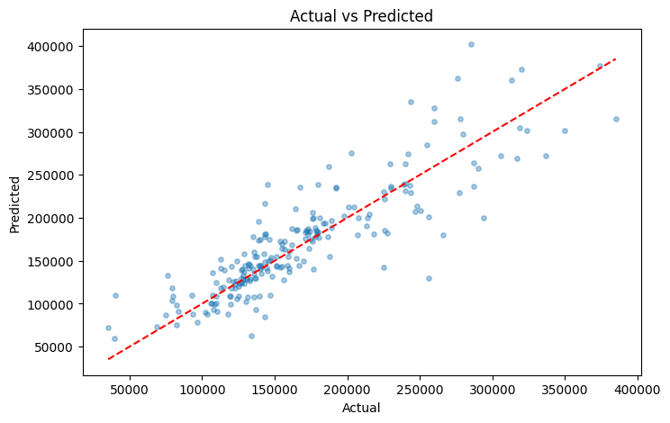
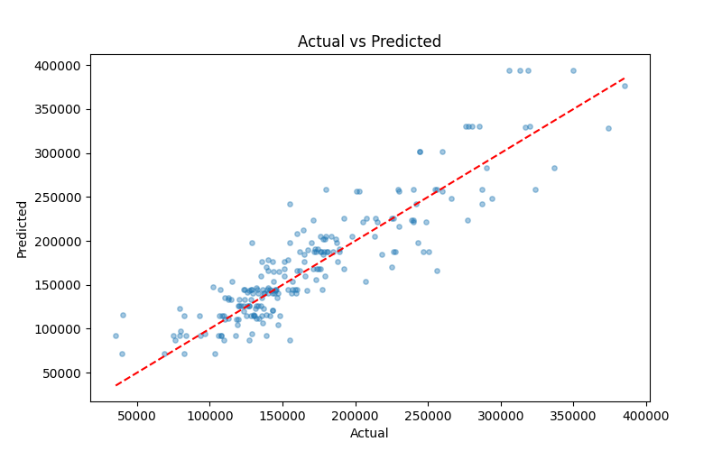

# სახლების ფასების პროგნოზირება — Kaggle Competition

## Kaggle-ის კონკურსის მიმოხილვა

კონკურსი: [House Prices — Advanced Regression Techniques](https://www.kaggle.com/competitions/house-prices-advanced-regression-techniques)

მიზანი: სახლების გასაყიდი ფასის (`SalePrice`) პროგნოზირება 79 სხვადასხვა მახასიათებლის საფუძველზე. 
შეფასება ხდება RMSE(root mean square error) მეტრიკით.

---

პრობლემას მივუდექი შემდეგნაირად:

1. მონაცემების გაწმენდა და ნულოვანი მნიშვნელობების დამუშავება
2. კატეგორიული ცვლადების რიცხვითში გადაყვანა One-Hot Encoding-ით
3. Feature Engineering - განვიხილე ახალი სვეტების დამატება  
4. Feature Selection — კორელაციაზე დაყრდნობით
5. Linear Regression მოდელის დატრეინება Cross-Validation-ით
6. ყველა ეტაპის MLflow-ზე დალოგვა DagsHub-ის გამოყენებით
7. Model Registry-დან მოდელის ჩატვირთვა და Kaggle-ის test set-ზე პროგნოზის გაკეთება

---

### ფაილების განმარტება

**`model_experiment.ipynb`** — მთავარი სამუშაო ნოუთბუქი. შეიცავს EDA-ს, მონაცემების გაწმენდას, Feature Engineering-ს, Feature Selection-ს, მოდელის სწავლებას და MLflow-ზე დალოგვას.

**`model_inference.ipynb`** — ინფერენს ნოუთბუქი. ჩატვირთავს რეგისტრირებულ მოდელს MLflow Model Registry-დან, ამუშავებს Kaggle-ის test set-ს და აგენერირებს `submission.csv` ფაილს.

**`train_columns.json`** — სასწავლო მონაცემების Feature Selection-ის შემდეგ დარჩენილი სვეტების სია. inference-ში გამოიყენება `reindex`-ისთვის, რათა test set-ს ზუსტად იგივე სვეტები ჰქონდეს, რაც სასწავლო მონაცემებს.

**`linear_regression_baseline_model`** — შეიცავს ექსპერიმენტის და ინფერენსის ფაილს baseline წრფივი რეგრესიისთვის

**`linear_regression_optimized_model`** — შეიცავს ექსპერიმენტის და ინფერენსის ფაილს optimized წრფივი რეგრესიისთვის

**`decision_tree_baseline_model`** — შეიცავს ექსპერიმენტის და ინფერენსის ფაილს baseline გადაწყვეტილების ხისთვის

**`decision_tree_optimized_model`** — შეიცავს ექსპერიმენტის და ინფერენსის ფაილს optimized გადაწყვეტილების ხისთვის

---

## პირველი მოდელი(Linear regression baseline model)

## Feature Engineering

### კატეგორიული ცვლადების რიცხვითში გადაყვანა

მონაცემთა ნაკრებში 43 კატეგორიული სვეტი იყო. ამ სვეტებისთვის გამოვიყენე **One-Hot Encoding** `pd.get_dummies(drop_first=True)` პარამეტრით.
`drop_first=True` გამოვიყენე ზედმეტი სვეტების თავიდან ასაცილებლად, რადგან, თუ პირველს გადავაგდებ, და დანარჩენები ყველა 0 - ია, ეგ გარანტირებულად
ნიშნავს, რომ პირველი 1 - ია, და ამ შემთხვევაში, ის პირველი სვეტი ზედმეტი გამოდის. 

Encoding-ის შემდეგ სვეტების რაოდენობა 81-დან **219-მდე** გაიზარდა.

### NaN მნიშვნელობების დამუშავება

**რიცხვითი სვეტები:**

სამი სვეტი შეიცავდა ნულოვან მნიშვნელობებს — `LotFrontage`, `MasVnrArea`, `GarageYrBlt`. თითოეულისთვის ინდივიდუალური გადაწყვეტილება მივიღე:

- `LotFrontage` (შენობის წინ მიმდებარე გზა): ნაგულისხმები მნიშვნელობა არარეალურია, ამიტომ შევავსე **მედიანით**
- `MasVnrArea` (ქვის/აგურის საფასადე ფართობი): სახლს შეიძლება საერთოდ არ ჰქონდეს ეს მახასიათებელი, ამიტომ NaN ჩავანაცვლე **0-ით**
- `GarageYrBlt` (გარაჟის აშენების წელი): ბუნდოვანი შემთხვევაა, გავიხელ **მედიანით**

**კატეგორიული სვეტები:**

11 კატეგორიული სვეტი შეიცავდა NaN-ს: `MasVnrType`, `BsmtQual`, `BsmtCond`, `BsmtExposure`, `BsmtFinType1`, `Electrical`, `FireplaceQu`, `GarageType`, `GarageFinish`, `GarageQual`, `GarageCond`. 
ყველა ჩავანაცვლე სტრიქონ **"None"**-ით — ლოგიკა ისაა, რომ NaN ამ კატეგორიებში ნიშნავს, რომ კონკრეტულ სახლს ეს მახასიათებელი უბრალოდ არ გააჩნია.

ეს, რა თქმა უნდა, ჩემი დაშვებაა, რადგან შეიძლება მართლა არ არსებობდეს Data იმ კონკრეტული სვეტისთვის. 

### Cleaning მიდგომები

გაწმენდის ეტაპზე ავარჩიე სვეტები, რომლებიც ზედმეტები ან ინფორმაციის გარეშე იყო:

**1. Id სვეტის წაშლა** — უნიკალური იდენტიფიკატორი. არ შეიცავს ჩვენთვის საჭირო, არანაირ pattern - ს

**2. „მეორეხარისხოვანი" სვეტების წაშლა** — პროგრამულად ამოვიცანი ის სვეტები, რომელთა სახელში '2' ციფრია (მაგ. `Condition2`, `Exterior2nd`). 
ეს ჩვეულებრივ მეორეხარისხოვანი/სარეზერვო მახასიათებლებია, რომლებიც ძირითადი სვეტის (Condition1, Exterior1st) დამატებით ინფორმაციას შეიცავს.
**გამონაკლისი:** `2ndFlrSF` (მეორე სართულის ფართობი) სიიდან ხელით ამოვიღე, რადგან ეს არაა რაიმე სვეტის გაფართოება, არამედ დამოუკიდებელი სვეტია
(პირველი სართულის ფართობი და მეორე სართულის ფართობი სხვადასხვა სვეტებია)

ესეც, რა თქმა უნდა, მნიშვნელოვანი დაშვებაა, რადგან შესაძლოა ეს დამატებითი სვეტები მნიშვნელოვან ინფორმაციას შეიცავდნენ. 

**3. დაბალი შევსების სვეტების წაშლა** — გამოვთვალე მთლიანი მონაცემთა ნაკრების საშუალო არა-null ჩანაწერების რაოდენობა და წავშალე ყველა სვეტი, 
რომელშიც არა NaN ინფორმაცია საშუალოზე 40% - ით ნაკლებია  
ამ ზღვრის მიხედვით წაიშალა: `Alley`, `PoolQC`, `Fence`, `MiscFeature`, `FireplaceQu`

---

## Feature Selection

### გამოყენებული მიდგომები

Feature Selection-ი სამ ეტაპად ჩავატარე 219 სვეტზე:

**ეტაპი 1 — დაბალი STD სვეტების ამოღება**

სვეტები, რომელთა STD ≤ 0.01 იყო, პრაქტიკულად კონსტანტური მნიშვნელობებია და კორელაციის გამოთვლისას პრობლემებს იწვევდა. 
ამოვიღე 2 სვეტი: `RoofMatl_Membran`, `Electrical_Mix`.

**ეტაპი 2 — სვეტებს შორის მაღალი კორელაციის ამოღება (threshold: 0.85)**

Multicollinearity-ის პრობლემის გამოსავლენად გამოვთვალე სვეტებს შორის ორი-ორი აბსოლუტური კორელაცია.
წყვილიდან ყოველთვის მეორე სვეტი ამოვიღე.
ამ ეტაპზე **13 სვეტი** ამოვიღე, მათ შორის: `GarageArea` (კორელირებს `GarageCars`-თან), `FireplaceQu_None`, `ExterQual_TA`, `BsmtCond_None`, `GarageFinish_None` და სხვ.

**ეტაპი 3 — სამიზნე ცვლადთან (SalePrice) დაბალი კორელაციის სვეტების ამოღება (threshold: 0.1)**

X_train-ის სვეტების კორელაცია y_train-თან გამოვთვალე. 0.1-ზე ნაკლები კორელაციის მქონე **102 სვეტი** ამოვიღე. 
ეს ძირითადად OHE-ის შედეგად მიღებული binary სვეტები იყო, რომლებიც იშვიათ კატეგორიებს წარმოადგენდნენ.

საბოლოო Feature რაოდენობა: **101 სვეტი**

**Top 10 სვეტი SalePrice-თან კორელაციის მიხედვით:**

| სვეტი | კორელაცია |
|---|---|
| OverallQual | 0.786 |
| GrLivArea | 0.696 |
| GarageCars | 0.641 |
| TotalBsmtSF | 0.598 |
| 1stFlrSF | 0.588 |
| FullBath | 0.553 |
| TotRmsAbvGrd | 0.520 |
| YearBuilt | 0.517 |
| KitchenQual_TA | 0.514 |
| YearRemodAdd | 0.509 |

### შეფასება

კორელაციაზე დაყრდნობილი Feature Selection მარტივი და ინტერპრეტირებადი მიდგომაა, თუმცა მას ნაკლოვანებები გააჩნია. 
ის ითვალისწინებს მხოლოდ linear კავშირს და ვერ ამოიცნობს nonlinear კავშირებს.
გარდა ამისა, სვეტებს ინდივიდუალურად ამოწმებს და ვერ ითვალისწინებს სვეტთა ჯგუფებს, რომლებმაც ერთობლივად შეიძლება მეტი ინფორმაციას შეიცავდნენ.

---

## Training

### ტესტირებული მოდელები

#### Linear Regression — Baseline

პირველი მოდელი Linear Regression-ია — კლასიკური საბაზისო მოდელი regression ამოცანებისთვის.

**Cross-Validation:** 5-fold CV სასწავლო მონაცემებზე, RMSE მეტრიკით.

**შედეგები:**

| მეტრიკა | მნიშვნელობა |
|---|---|
| Train RMSE | 27,969 |
| Test RMSE | 30,691 |
| Train R² | 0.869 |
| Test R² | 0.877 |
| CV RMSE (5-fold) | 34,025 |
| Kaggle Score (log RMSE) | 0.18188 |

### Overfitting / Underfitting ანალიზი

Train RMSE (27,969) და Test RMSE (30,691) შორის სხვაობაა **2,721** — შედარებით მცირე. ეს ნიშნავს, რომ მოდელს არ აქვს ძლიერი overfitting სასწავლო მონაცემებზე.

თუმცა, CV RMSE (34,025) Test RMSE-ზე (30,691) შედარებით მაღალია. 

ეს განსხვავება მიუთითებს, რომ 80/20 test split-ზე, ტესტში უბრალოდ გაგვიმართლა 

CV RMSE უფრო სანდო შეფასებაა.

ვფიქრობ, რომ ამის ძირითადი მიზეზია ზოგიერთი მაღალი ფასი target - ში და რამდენიმე გადაწყვეტილება, რომელმაც, ვფიქრობ, 
გავლენა იქონია შედეგზე(ამ ყოველივეს ჩამოვწერ) 

---
რამ გამოიწვია ჩემი მოდელის ცუდი პერფორმანსი? 

მივიღე რამდენიმე გადაწყვეტილება baseline მოდელის პრეპროცესინგის წერის პროცესში:  

1) არ მივაქციე ყურადღება feature engineering - ს, ანუ არ შემიქმნია ახალი სვეტები(გარდა სვეტებისა, რომელიც one hot 
encoding - მა წარმოქმნა)

2) არ მივაქციე ყურადღება target - ის განაწილებას, შესაძლებელია, training data - ში გვქონდეს ისეთი მნიშვნელობები, 
რომლებიც გამონაკლისად ჩაითვლება. მაგალითად, რაიმე მდიდრული სასახლე, რომლის ფასი 1 000 000 დოლარია. თუ სახლების საშუალო ფასია 100 000 დოლარი,
პირობითად, 1 000 000 დოლარიანი სახლი ნამდვილად იშვიათობაა და ეს, რა თქმა უნდა, გავლენას იქონიებს მოდელზე. ასეთი მნიშვნელობები, ჯობია
საერთოდ არ იყოს training data - ში. 

3) გადავყარე სვეტები, რომლებსაც, შესაძლოა, დიდი დატვირთვა ჰქონდა მოდელის პერფორმანსზე(ვგულისხმობ სვეტებს, რომელთა სახელშიც '2' გვაქვს). 
მიმაჩნია, რომ თუ ამ სვეტებს target - თან კორელაციამდე გავიყვანდი, იქ გამოაჩენდნენ რამდენად ღირებულები იყვნენ.

4) ასევე კარგი იქნება, თუ ვცდი რეგულარიზაციის მეთოდებს. აქ გამოვიყენე წმინდა LinearRegression 

ყოველშემთხვევაში, თუ მთლად overfitting არაა დაფიქსირებული(სხვაობა 2721 - ა და არაა მნიშვნელოვანი იდენთიფიკატორი overfitting - ის), 
ამ მოდელს მაინც უჭირს ნამდვილ data - ზე შედეგების დადება. 

ამ ყოველივეს გავაუმჯობესებ მეორე მოდელის ტრენინგისას
--- 

## MLflow Tracking

### ექსპერიმენტების ბმული

DagsHub MLflow: [https://dagshub.com/gbera23-dev/Machine-Learning.mlflow](https://dagshub.com/gbera23-dev/Machine-Learning.mlflow)

ექსპერიმენტი: **House prices**  
Run სახელი: **linear_regression_baseline_model_1..4**

მოცემული ექსპერიმენტი ჩავატარე ოთხჯერ სხვადასხვა კორელაციის threshold - ებისთვის. 

და აღმოვაჩინე შემდეგი კანონზომიერება: რაც უფრო იზოლირებულს გავხდით კარგ პარამეტრებს, მით უფრო ცუდი პერფორმანსი  
აქვს მოდელს.

შესაბამისი ცხრილი ამ გაშვებების მონაცემებისა: 

| Run | Threshold (between) | Dropped (intercorr) | Threshold (target) | Dropped (low corr) | Final Features | Test R² | Test RMSE | Test MAE | CV RMSE |
|---|---|---|---|---|---|---|---|---|---|
| 1 | 0.85 | 13 | 0.10 | 102 | 101 | 0.877 | 30,691 | 20,046 | 34,025 |
| 2 | 0.85 | 13 | 0.15 | 132 | 71 | 0.871 | 31,464 | 19,909 | 34,035 |
| 3 | 0.80 | 20 | 0.20 | 146 | 50 | 0.858 | 33,049 | 20,853 | 34,934 |
| 4 | 0.80 | 20 | 0.25 | 158 | 38 | 0.847 | 34,290 | 21,957 | 36,156 |

---
## მეორე მოდელი(Linear regression optimized model)

## Target Analysis

ამოვიღე სახლები, რომელთა ფასი 99%-ის quantile-ს აღემატებოდა. 
შედეგად 15 სტრიქონი ამოვიღე (1460 → 1445). ეს ექსტრემალური მნიშვნელობები მოდელს მნიშვნელოვნად აბნევდა, რადგან
ასახავდა ძვირადღირებული სახლების(სასახლეების) ფასებს, რომელიც data - ში ხშირად არ გვხვდება, ამიტომ უმჯობესი იქნება
მათი მოშორება.                                                                                          

---

## Cleaning

**ამოღებული სვეტები:**
- `Id` — უნიკალური იდენტიფიკატორი
- 40%-ზე ნაკლები შევსების სვეტები: `PoolQC`, `MiscFeature`, `Alley`, `Fence`

**განსხვავება baseline-თან:** secondary columns (`Condition2`, `Exterior2nd` და სხვ.) 
**არ ამოვაგდე** — ნება დავრთე კორელაციას გადაეწყვიტა სვეტების ამოღება.

---

## Missing Value Handling

**განსხვავება baseline-თან:** baseline-ში სამი numerical სვეტი ცალ-ცალკე დავამუშავე.
ამჯერად universal მიდგომა გამოვიყენე:

- ყველა numerical სვეტი NaN → **მედიანა**
- ყველა categorical სვეტი NaN → **"None"**

ეს უფრო მდგრადია — test set-ში ახალი null სვეტების გაჩენისას ავტომატურად გამოიყენება.

---

## Feature Engineering

baseline-ში feature engineering საერთოდ არ ყოფილა. ამ ვერსიაში 5 ახალი სვეტი შევქმენი:

| სვეტი | ფორმულა | ლოგიკა                                             |
|---|---|----------------------------------------------------|
| `TotalSF` | `TotalBsmtSF + 1stFlrSF + 2ndFlrSF` | სახლის მთლიანი ფართობის სვეტის დამატება საკმაოდ ბუნებრივია |
| `HouseAge` | `YrSold - YearBuilt` | სახლის ასაკი(ანუ დრო აგებიდან გაყიდვამდე)          |
| `RemodAge` | `YrSold - YearRemodAdd` | დრო გაყიდვიდან ბოლო რემონტამდე                     |
| `TotalBath` | `FullBath + 0.5*HalfBath + BsmtFullBath + 0.5*BsmtHalfBath` | სველი წერტილების საერთო მაჩვენებელი                |
| `IsRemodeled` | `(YearRemodAdd != YearBuilt).astype(int)` | binary — გაკეთდა თუ არა რემონტი                    |

---

## Turning Categorical Variables to Numeric

One-Hot Encoding იგივე მეთოდით — `pd.get_dummies(drop_first=True)`. 
secondary columns-ის შენარჩუნების გამო სვეტების რაოდენობა 219-დან **253-მდე** გაიზარდა.

---

## Feature Selection

სამი ეტაპი იგივეა, მაგრამ შედეგები განსხვავებული:

**ეტაპი 1 — დაბალი std:**
ამოვიღე 3 სვეტი: `Neighborhood_Blueste`, `Exterior2nd_Other`, `Functional_Sev`

**ეტაპი 2 — სვეტებს შორის კორელაცია (threshold: 0.85):**
ამოვიღე **23 სვეტი** (baseline-ში 13 იყო). მეტი სვეტი იყო კორელირებული, რადგან secondary columns-ს ვინახავდით.

**ეტაპი 3 — target-თან კორელაცია (threshold: 0.25):**
ორი threshold განვიხილე: 0.1 და 0.25. როგორც აღმოჩნდა, 0.25 მნიშვნელოვნად ზღუდავდა მოდელის პერფორმანსს(ზუსტად იგივე
მოხდა baseline მოდელშიც)

---

## Training

### Overfitting / Underfitting ანალიზი

ამ შემთხვევაში ორივე target threshold(0.25, 0.1) - ის პირობებში დაფიქსირდა უცნაური მოვლენა: Train RMSE - მ ოდნავ 
გადააჭარბა Test RMSE - ის, რაც წესით არ უნდა ხდებოდეს, თუმცა მივაწერე იმ ფაქტს, რომ შესაძლოა საკმაოდ კარგი სპლიტი 
გამოვყავი.

ასევე გავითვალისწინე ის ფაქტიც, რომ მიღებული RMSE შედეგები მნიშვნელოვნად უკეთესი იყო baseline - თან შედარებით. და არა
მარტო ამ პარამეტრით. ოპტიმიზირებულმა წრფივმა რეგრესიამ baseline რეგრესიას ყველაფერში აჯობა. 

თუ Train და Test RMSE მნიშვნელოვნად გადააჭარბებდა baseline - ის შედეგებს, ამ შემთხვევაში, ვიტყოდი, რომ გვაქვს
underfitting. მოდელი ვერ ახერხებს ვერც Train და ვერც Test Data - ზე მორგებას სიმარტივის გამო. ეს ასე არ მოხდა 
ჩვენს შემთხვევაში, ამიტომ 

ჩვენი მოდელისთვის არ ფიქსირდება არც underfitting და არც overfitting
---

## MLflow Tracking

DagsHub MLflow: [https://dagshub.com/gbera23-dev/Machine-Learning.mlflow](https://dagshub.com/gbera23-dev/Machine-Learning.mlflow)

ექსპერიმენტი: **House prices**
Run სახელი: **linear_regression_optimized_model1..3**

აქ მოდელი გავუშვი შვიდჯერ სხვადასხვა ცვლადებისთვის. კერძოდ, მაინტერესებდა Ridge - ის Alpha კოეფიციენტის ოპტიმალური
მნიშვნელობა. განვიხილე Alpha = 2, 10.0, 20.0 

Alpha = 10 - ზე RMSE და R^2 გაუმჯობესდა, Alpha = 20 - ზე კი გაუარესდა, ამიტომ ავიღე ამ ორის საშუალო Alpha = 15.
Alpha = 15 - ზეც შედეგი Alpha = 10 - ზე უარესი იყო, ამიტომ საბოლოოდ ავიღე მათი საშუალო Alpha = 12.5. შედეგი Alpha = 10
- ზე უკეთესი არ იყო, ამიტომ საუკეთესო შედეგად ამ მოდელებს შორის ავიღე მეოთხე მოდელი.
 

პერფორმანსის ცხრილი: 

 | Run | Model             | Alpha | Threshold | Test RMSE | Test R² | Test MAE |
 |-----|-------------------|-------|-----------|-----------|---------|----------|
 | 1   | Linear Regression | -     | 0.25      | 24,137    | 0.8531  | 18,772   |
 | 2   | Ridge             | 2.0   | 0.25      | 24,045    | 0.8542  | 18,740   |
 | 3   | Ridge             | 2.0   | 0.10      | 21,972    | 0.8782  | 16,654   |
| 4   | Ridge             | 10.0  | 0.10      | 21,886    | 0.8791  | 16,753   |
| 5   | Ridge             | 20.0  | 0.10      | 21,981    | 0.8781  | 16,753   |
| 6   | Ridge             | 15.0  | 0.10      | 21,924    | 0.8787  | 16,902   |
| 7   |   Ridge           | 12.5  | 0.10      | 21,901    | 0.8790  | 16,806   |
---ად
                 
 ## მესამე მოდელი(Decision tree baseline model)

Decision tree - ის ტრენინგისას გამოვიყენე იგივე feature engineering, რაც ოპტიმიზირებული წრფივი რეგრესიის 
შემთხვევაში. 

განსხვავება ის არის, რომ განაწილების ანალიზი ამოვიღე, რადგან Decision tree - ს არ აინტერესებს, თუ როგორი ტიპის 
განაწილებისგანაა წარმოქმნილი მოცემული Data. 

ამ შემთხვევაში ვატრენინგე Decision tree არანაირი პარამეტრების შერჩევით. Decision tree - ის აქვს თავისუფლება, რომ 
ჰქონდეს ნებისმიერი სიღრმე.
---

## Training

baseline მოდელისთვის გამოვიყენე DecisionTreeRegressor, რომელიც წარმოადგენს სპეციალურ გადაწყვეტილების ხეს რეგრესიის 
ამოცანებისთვის. 

აქ დავატრენინგე ორი მოდელი. ერთის შემთხვევაში გამოვიყენე One hot encoding, მეორესთვის კი weight of evidence. 

თითოეული მოდელის შედეგები ცხრილად:

| Run | Model         | Alpha | Threshold | Test RMSE | Test R² | Test MAE |
 |-----|---------------|-------|-----------|-----------|---------|----------|
 | 1   | Decision tree | -     | 0.1       | 30,434    | 0.77    | 21,850   |
 | 2   | Decision tree | -     | 0.1       | 32,412    | 0.74    | 22,772   |

### Overfitting / Underfitting ანალიზი

## პირველი მოდელი 

ამ შემთხვევაში გვაქვს ძალზედ საინტერესო შემთხვევა. მოდელმა გააკეთა overfitting მოცემულ training data - ზე. 

მოდელმა ზედმეტად კარგად შეაფასა training data. აღმოაჩინა სპეციფიკური სტრუქტურა, რომელიც ზუსტად ემთხვევა 
training data - ს, თუმცა, სამწუხაროდ, ვერ განზოგადდა test data - სთვის. 

შესაბამისი მტკიცებულებები:

ამ სურათზე აშკარად ჩანს, რომ ლურჯი წერტილები საერთოდ არ მიჰყვება წრფეს, არამედ ქმნის უჩვეულო სტრუქტურას, როგორც ჩანს, 
training data სწორედ ამ სტრუქტურას მიჰყვება. 

Train RMSE: 151.33768355086158
Test RMSE: 30434.409905709617
Train R2: 0.9999954040350852
Test R2: 0.7663945166029227
Difference: 30283.072222158757

როგორც ვხედავთ, Train RMSE მიზერული მნიშვნელობისაა(რაც ნიშნავს, რომ მოდელმა ზედმეტად კარგად გამოიცნო training data - ს
სტრუქტურა) და თუ დავაკვირდებით უნახავ data - ს(30434) და ვიპოვით განსხვავებას, მივიღებთ 30283 - ს. ეს აშკარა, 
წყალგაუვალი მტკიცებულებაა იმისა, რომ გვაქვს overfitting. 

### პირველ მოდელში გვაქვს overfitting

## მეორე მოდელი 

მოსალოდნელი იყო, რომ მეორე მოდელის შედეგი გაუმჯობესდებოდა, თუმცა ყოველივე პირიქით მოხდა. 

აქაც გვაქვს overfitting. განზოგადება კიდევ უფრო უარესია. 

შესაბამისი მტკიცებულებები: 

აქ, ლურჯი წერტილები კიდევ უფრო უცნაურ სტრუქტურას ქმნიან. 

Train RMSE: 151.33768355086158
Test RMSE: 32412.980607920046
Train R2: 0.9999954040350852
Test R2: 0.7350333589635607
Difference: 32261.642924369185

აქ კიდევ უფრო მეტადაა გამოკვეთილი სხვაობა Train და Test RMSE - ებს შორის.

### მეორე მოდელშიც გვაქვს overfitting
---

## შეჯამება 

baseline მოდელების ტრენინგისას დაფიქსირდა აშკარა overfitting, რაც მოსალოდნელი იყო, რადგან არანაირი 
პარამეტრები არ შემოგვიღია.

## მეოთხე მოდელი(Decision tree optimized model)

## preprocessing

მესამე მოდელისგან განსხვავებით. აქ ყველა მოდელში მაქვს weight of evidence გამოყენებული, სხვა მხრივ კი პრეპროცესინგის 
ნაწილი იდენტურია. 

მოცემული მოდელებისთვის განვიხილე სხვადასხვა ჰიპერპარამეტრები, და ანალიზის შემდეგ მივედი საუკეთესო მოდელამდე, რომელსაც 
არ ახასიათებს overfitting და აცდენილი არაა მნიშვნელოვნად prediction - ებს 

## Training

optimized მოდელისთვის გამოვიყენე კვლავ DecisionTreeRegressor. 

თუმცა ვცვალე ორი პარამეტრი: Tree depth და Min samples leaf. 

ამ პარამეტრების ცვლილებებმა გავლენა იქონია Overfitting - ზე მნიშვნელოვნად. 

დავატრენინგე ხუთი მოდელი სხვასხვა პარამეტრებით: 

პერფორმანსის ცხრილი: 

 | Run | Model         | min_samples_leaf | max_depth | Threshold | Test RMSE | Test R² | Test MAE |
 |-----|---------------|------------------|----------|-----------|-----------|---------|----------|
 | 1   | decision tree | 3                | 20       | 0.1       | 32,412    | 0.74    | 22,772   | 
 | 2   | decision tree | 5                | 15       | 0.1       | 31,533    | 0.75    | 22,279   | 
 | 3   | decision tree | 7                | 10       | 0.1       | 31,904    | 0.74    | 23,143   | 
 | 4   | decision tree | 10               | 5        | 0.1       | 32,038    | 0.74    | 23,489   | 
 | 5   | decision tree | 15               | 2        | 0.1       | 35,787    | 0.67    | 26,109   | 
---

### Overfitting / Underfitting ანალიზი

იმის დასანახად, თუ როგორ იცვლებოდა მოდელთა ყოფაქცევა სხვადასხვა პარამეტრებზე, 
საინტერესოა იქნება დავხაზოთ დიაგრამა, რომელზეც აღწერილი იქნება თითოეული მოდელისთვის ABS(test_rmse - test_rmse) 

მოდელი 1: Test RMSE = 31520.72 | Train RMSE = 8577.31

მოდელი 2: Test RMSE = 31533.69 | Train RMSE = 17521.47

მოდელი 3: Test RMSE = 31904.94 | Train RMSE = 23344.37

მოდელი 4: Test RMSE = 32038.49 | Train RMSE = 28139.31

მოდელი 5: Test RMSE = 35787.26 | Train RMSE = 36364.34

ეს დიაგრამაზე: 

ასევე დავაკვირდეთ იმ ფაქტს, რომ სიღრმე უფრო და უფრო შევამცირეთ. 

ანუ გვაქვს კორელაცია სიღრმის შემცირებასა და overfitting - ის ნეიტრალიზაციას შორის. 

თითოეული მოდელის შესაბამისი გრაფიკები: 

## პირველი

## მეორე 

## მესამე 

## მეოთხე

## მეხუთე 

როგორც ვხედავთ სიღრმის მნიშვნელოვნად შემცირება, ამცირებს overfitting - ს, თუმცა უფრო არაპროგნოზირებადს ხდის შედეგებს. 
მესამედან მეხუთემდე, ყველა მოდელში ვხვდებით ასეთ სიტუაციას. 

გავაკეთებ ზედა ხუთიდან საუკეთესოსთვის კიდევ ერთ ტრენინგს, ოღონდ one hot encoding - ის გამოყენებით, რათა დავინახო, 
რამდენად დაეხმარება განსხვავებული მიდგომა ხეს

საუკეთესო test_rmse ქულით არის პირველი, თუმცა აქვს სერიოზული overfitting. ამიტომ ავიღებ ისეთს, რომ ორივე ძალიან
ცუდი არ ჰქონდეს, ამ შემთხვევაში, მესამეს.

შედეგი: 

Train RMSE: 22723.306451138695
Test RMSE: 29788.900153235703
Train R2: 0.8963842937911564
Test R2: 0.7761989091583714
Difference: 7065.593702097009

რაც ხუთივე მოდელზე უფრო ძლიერი შედეგია. ანუ OHE უკეთესია WOE - ზე გადაწყვეტილებების ხის შემთხვევაში. და ასევე ამ მოდელს არ
აღენიშნება overfitting.

---

## შეჯამება 

ამ ამოცანისთვის ვატრენინგეთ ორი განსხვავებული ტიპის მოდელები: წრფივი რეგრესია და გადაწყვეტილების ხეები. 

წრფივ რეგრესიაში განვიხილეთ სტანდარტული და რეგულარიზებული(ridge regularization) მოდელები. 

გადაწყვეტილების ხეებში კი სტანდარტული(default პარამეტრები და ულიმიტო სიღრმე) და რეგულარიზებული(მაქსიმალური სიღრმე 
და min_samples_leaf) მოდელები 

---

## შეფასება 

წრფივი რეგრესიის მოდელებმა უკეთესი შედეგი დადეს მოცემული ამოცანისთვის, კერძოდ რეგულარიზებულმა წრფივმა რეგრესიამ. 

### გამარჯვებული წრფივ რეგრესიაში

linear_regression_optimized_model/4

მეტრიკები
mean_cv_rmse	27786.4
std_cv_rmse	    7067.1	
test_mae	    16753.3
test_r2	        0.879	
test_rmse	    21886	

### გამარჯვებული გადაწყვეტილების ხეებში 

house_prices_decision_tree_optimized/6 

მეტრიკები: 
mean_cv_rmse 34310.7
std_cv_rmse	 4025.2
test_mae	 22300
test_r2	     0.776
test_rmse	 29788.9

### გამარჯვებული მოდელი ზოგადად ტრენინგში

linear_regression_optimized_model/4

მეტრიკები
mean_cv_rmse	27786.4
std_cv_rmse	    7067.1	
test_mae	    16753.3
test_r2	        0.879	
test_rmse	    21886	

### Kaggle submission შედეგი

0.157

---

