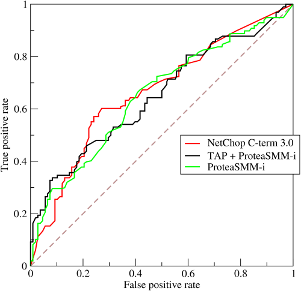

# IEEE-CIS Fraud Detection — Kaggle Competition

## კონკურსის მიმოხილვა

კონკურსი: [IEEE-CIS Fraud Detection](https://www.kaggle.com/competitions/ieee-fraud-detection)

კონკურსი ეხება საბანკო გადახდებში თაღლითობის აღმოჩენას. კერძოდ, მოცემულია გადახდები (ტრანზაქციები) და მიზანია, დავადგინოთ — არის თუ არა კონკრეტული ტრანზაქცია თაღლითური. ანუ, უფრო ზუსტად, უნდა დავწეროთ ალბათობა, რომ მოცემული ტრანზაქცია თაღლითობას წარმოადგენს. ეს არის **კლასიფიკაციის პრობლემა**.

მონაცემები მოცემულია ორ ცხრილად, რომლებიც ერთმანეთთან TransactionID-ს მეშვეობით არიან დაკავშირებული. ამ პრობლემის გადასაჭრელად ვიყენებ **LEFT JOIN**-ს, რათა მივიღო ერთი მთლიანი ცხრილი და ტრანზაქციის ინფორმაცია არ დამეკარგოს, თუ შესაბამისი Identity ჩანაწერი ვერ მოიძებნა.

**კატეგორიული სვეტები:**

| წყარო | სვეტები |
|-------|---------|
| Transaction | ProductCD, card1–card6, addr1, addr2, P\_emaildomain, R\_emaildomain, M1–M9 |
| Identity | DeviceType, DeviceInfo, id\_12–id\_38 |

**შეფასების მეტრიკა:** ROC-AUC (გვინდა შედეგი 1-თან ახლოს)



---

## ჩემი მიდგომა

გადავწყვიტე, გამომეყენებინა მოდელები, რომლებიც კლასიფიკაციის პრობლემებს კარგად ერგება. პირველ რიგში, ეს არის ლოგისტიკური რეგრესია — ყველაზე მარტივი საბაზო მოდელი. შემდეგ გადავედი ხის მოდელებზე: გადაწყვეტილების ხე (Decision Tree) და ხის ანსამბლის მოდელები — XGBoost, LightGBM, Random Forest.

ვინაიდან მონაცემები ძალიან დიდი იყო (ტრენინგი 10 წუთამდე გრძელდებოდა), ჰიპერპარამეტრების შერჩევა ვაწარმოე სატრენინგო მონაცემებიდან აღებულ 10 000 მონაცემზე, საუკეთესო ვარიანტი კონკრეტული მოდელისთვის კი დავატრენინგე მთლიან მონაცემებზე.

---

## რეპოზიტორიის სტრუქტურა

```
├── model_experiment_Logistic_regression.ipynb
├── model_experiment_Decision_tree.ipynb
├── model_experiment_Random_forest.ipynb
├── model_experiment_XGBoost.ipynb
├── model_experiment_LightGBM.ipynb
├── model_inference.ipynb
└── README.md
```

| ფაილი | აღწერა |
|-------|--------|
| `model_experiment_Logistic_regression.ipynb` | პრეპროცესინგის პაიპლაინი და ლოგისტიკური რეგრესიის მოდელების ტრენინგი სხვადასხვა ჰიპერპარამეტრებზე |
| `model_experiment_Decision_tree.ipynb` | პრეპროცესინგის პაიპლაინი და გადაწყვეტილების ხის მოდელების ტრენინგი სხვადასხვა ჰიპერპარამეტრებზე |
| `model_experiment_Random_forest.ipynb` | პრეპროცესინგის პაიპლაინი და Random Forest მოდელების ტრენინგი სხვადასხვა ჰიპერპარამეტრებზე |
| `model_experiment_XGBoost.ipynb` | პრეპროცესინგის პაიპლაინი და XGBoost მოდელების ტრენინგი სხვადასხვა ჰიპერპარამეტრებზე |
| `model_experiment_LightGBM.ipynb` | პრეპროცესინგის პაიპლაინი და LightGBM მოდელების ტრენინგი სხვადასხვა ჰიპერპარამეტრებზე |
| `model_inference.ipynb` | MLflow-დან საუკეთესო მოდელის ჩამოტვირთვა, მონაცემების პრეპროცესინგი და საბოლოო შედეგების გენერირება |

---

## Feature Engineering

### კატეგორიული ცვლადების რიცხვითში გადაყვანა

კატეგორიული სვეტების ენკოდინგისთვის გამოვიყენე ორი სხვადასხვა მიდგომა:

**One-Hot Encoding** — გამოვიყენე ისეთ კატეგორიულ სვეტებზე, რომლებსაც 5 ან ნაკლები უნიკალური კატეგორია ჰქონდა. ეს შეზღუდვა იმიტომ გავაკეთე, რომ ბევრი კატეგორიის შემთხვევაში OHE ქმნის ამავე რაოდენობის ახალ სვეტს, რაც მნიშვნელოვნად გაზრდიდა განზომილებებს.

**Weight of Evidence (WoE)** — გამოვიყენე დანარჩენ კატეგორიულ სვეტებზე (5-ზე მეტი კატეგორიით). WoE ინარჩუნებს სვეტების რაოდენობას და target-თან კავშირს ასახავს ერთ რიცხვში.

> **შენიშვნა LightGBM-ისთვის:** LightGBM-ის იმპლემენტაცია JSON-ის სპეციალური სიმბოლოების გამოყენებას სვეტების სახელებში კრძალავს. OHE ამ სიმბოლოებს ქმნის, ამიტომ `Preprocessor` კლასს დამატებულია ახალი მეთოდი, რომელიც `transform`-ის ბოლოს ამ სიმბოლოებს ფილტრავს.

### NaN მნიშვნელობების დამუშავება

NaN-ების შევსება მოდელის ტიპზეა დამოკიდებული:

| მოდელი | NaN-ების შევსების მეთოდი | დასაბუთება |
|--------|--------------------------|------------|
| XGBoost, LightGBM, Decision Tree, Random Forest | **-999** | ხის მოდელებს შეუძლიათ -999 ნამდვილი მნიშვნელობებისგან ადვილად გამოყონ, ამიტომ ის კარგი სენტინელის (sentinel) მნიშვნელობაა |
| Logistic Regression | **0** | წრფივ მოდელებში -999 იქცევა outlier-ად და აუარესებს პერფორმანსს |

### Cleaning მიდგომები

**V-ტიპის სვეტების აგრეგაცია:** მონაცემებში V სახელის მქონე 339 სვეტი მოიძებნა. სანამ feature selection ამ სვეტების დიდ ნაწილს დაადროპავდა, მათგან შევქმენი ახალი სინთეზური სვეტები, რომლებიც V-ების შეჯამებულ ინფორმაციას ატარებენ:

| ახალი სვეტი | აღწერა |
|-------------|--------|
| `min_V` | V-სვეტების მინიმალური მნიშვნელობა |
| `max_V` | V-სვეტების მაქსიმალური მნიშვნელობა |
| `avg_V` | V-სვეტების საშუალო მნიშვნელობა |
| `total_V` | V-სვეტების ჯამი |

**Preprocessor კლასი:** ყოველივე ზემოხსენებული გაერთიანებულია `Preprocessor` კლასში, რომელიც არის `BaseEstimator`-ისა და `TransformerMixin`-ის შვილობილი კლასი. ეს საშუალებას იძლევა ჩვენი Preprocessor კლასი sklearn-ის Pipeline-ში მოვათავსოთ და inference-ში მონაცემთა ხელახლა დამუშავება არ მოგვიწიოს.

> **ლოგისტიკური რეგრესია:** `Preprocessor`-ს ამ მოდელისთვის დამატებული აქვს **Scaler**, ვინაიდან წრფივ მოდელებს არ მოსწონთ მონაცემები, რომლებიც არათანაბრად არიან განაწილებული.

---

## Feature Selection

### გამოყენებული მიდგომები

**კორელაციის ფილტრები** (ორი ბარიერი):

| ფილტრი | ზღვარი | მიზანი |
|--------|--------|--------|
| სვეტი ↔ Target კორელაცია | < 0.01 | target-თან კავშირის არმქონე სვეტების მოცილება |
| სვეტი ↔ სვეტი კორელაცია | > 0.95 | ძლიერ კორელირებული (ზედმეტი) სვეტების მოცილება |

**შედეგი:** ამ ფილტრების გამოყენებით 400-მდე სვეტი დაიდროპა.

---

## Training

### ტესტირებული მოდელები

| მოდელი | ტიპი | მახასიათებელი |
|--------|------|----------------|
| Logistic Regression | წრფივი | საბაზო მოდელი, L1/L2 რეგულარიზაციით |
| Decision Tree | ხე | ერთი გადაწყვეტილების ხე |
| Random Forest | Bagging ანსამბლი |  Bagging-ზე დაფუძნებული ხის ანსამბლის მოდელი |
| XGBoost | Boosting ანსამბლი | Gradient Boosting |
| LightGBM | Boosting ანსამბლი | სწრაფი Gradient Boosting |

---

### XGBoost

**Hyperparameter Tuning:** პირველ ეტაპზე შევამოწმე ხის სიღრმე (სხვა პარამეტრები დავტოვე default):

| სიღრმე | mean\_train\_AUC | test\_AUC |
|--------|-----------------|-----------|
| d = 3 | 0.95 | 0.851 |
| d = 5 | 0.96 | **0.857** |
| d = 7 | 0.97 | 0.854 |
| d = 9 | 0.98 | 0.853 |

თუ შედეგებს დავაკვირდებით, აღმოვაჩენთ, რომ სიღრმის ზრდასთან ერთად ტრენინგის AUC იზრდება, ხოლო test_AUC საშუალოდ იგივე რჩება. 

ეს არის ზოგადად ხის სტრუქტურების ერთ-ერთი მნიშვნელოვანი ხარვეზი, ისინი მიდრეკილები არიან overfitting-ისკენ. XGBoost-ის მიზანი სწორედ ისაა, რომ 
ოპტიმიზაცია გაუკეთოს გადაწყვეტილებების ხის არქიტექტურას, რომ overfitting არ მოხდეს. 

ამას დავინახავთ ჩვეულებრივი გადაწყვეტილების ხის განხილვისას(გადაწყვეტილების ხეს გავუშვებ სიღრმის შეუზღუდავად) და დავინახავთ, რომ მას ექნება იდეალური შედეგი 
ტრენინგის მონაცემებზე, თუმცა არც თუ ისე სახარბიელო შედეგი ტესტ მონაცემებზე. 

ამ მაგალითში, სიღრმის გაზრდასთან ერთად, მოდელი უფრო და უფრო მიდრეკილი ხდება overfitting-ისკენ. d=9-ისთვის მოდელი თითქმის იდეალურად ამოიცნობს ტრენინგის 
მონაცემებზე fraud-ის ალბათობას, თუმცა test_AUC კვლავ შედარებით დაბალი რჩება. 

ამ მოდელებიდან ავიღე ის მოდელი, რომელსაც საუკეთესო შედეგი ჰქონდა ტესტ მონაცემებზე, და ეს არის მოდელი სიღრმით 5. ეს არის variance-bias trade-off. მე შევწირე 
ტრენინგის მონაცემებზე ძალიან კარგი შედეგი იმას, რომ უკეთესი ტესტ პერფორმანსი მქონოდა. ანუ გავზარდე ოდნავ Bias, Variance-ის შემცირების ხარჯზე. 


მეორე ეტაპზე განვიხილე 16 მოდელი `n_estimators`, `learning_rate` და `gamma`-ს ვარიაციით (d=5 ფიქსირებული):

| run | n\_estimators | learning\_rate | max\_depth | gamma | mean\_train\_auc | mean\_val\_auc | std\_val\_auc | auc\_gap |
|-----|--------------|----------------|------------|-------|-----------------|----------------|---------------|----------|
| 5 | 100 | 0.10 | 5 | 0.1 | 0.9816 | **0.8549** | 0.0055 | 0.1267 |
| 6 | 100 | 0.10 | 5 | 1.0 | 0.9700 | 0.8547 | 0.0104 | 0.1153 |
| 14 | 500 | 0.10 | 5 | 1.0 | 0.9700 | 0.8547 | 0.0104 | 0.1153 |
| 12 | 500 | 0.05 | 5 | 1.0 | 0.9674 | 0.8531 | 0.0082 | 0.1142 |
| 4 | 100 | 0.05 | 5 | 1.0 | 0.9609 | 0.8518 | 0.0098 | 0.1091 |
| 9 | 500 | 0.01 | 5 | 0.1 | 0.9608 | 0.8509 | 0.0101 | 0.1099 |
| 10 | 500 | 0.01 | 5 | 1.0 | 0.9603 | 0.8508 | 0.0088 | 0.1095 |
| 3 | 100 | 0.05 | 5 | 0.1 | 0.9622 | 0.8501 | 0.0113 | 0.1121 |
| 16 | 500 | 0.20 | 5 | 1.0 | 0.9714 | 0.8486 | 0.0090 | 0.1228 |
| 8 | 100 | 0.20 | 5 | 1.0 | 0.9714 | 0.8486 | 0.0090 | 0.1228 |


Default პარამეტრების (d=5) პერფორმანსი ვერ გავაუმჯობესე, ამიტომ საბოლოო მოდელი ამ სიღრმით გავუშვი მთლიან მონაცემებზე შემდეგი პარამეტრებით:

| პარამეტრი | მნიშვნელობა |
|-----------|-------------|
| `max_depth` | 5 |
| `n_estimators` | 1000 |
| `learning_rate` | 0.05 |
| `subsample` | 0.8 |
| `colsample_bytree` | 0.8 |
| `early_stopping_rounds` | 50 |
| `train_size` | full |

**XGBoost საბოლოო შედეგები (მთლიანი მონაცემები):**

| მეტრიკა | მნიშვნელობა |
|---------|-------------|
| test\_accuracy | 0.9784 |
| test\_auc | **0.9369** |

---

### Decision Tree

გადაწყვეტილების ხისთვის გავაკეთე ზუსტად იგივე პრეპროცესინგი, რადგან მსურს, რომ დავინახო რამდენად უკეთეს შედეგს დებს გადაწყვეტილების ხეებზე დაყრდნობილი მოდელი 
უბრალოდ ერთ გადაწყვეტილების ხესთან შედარებით.

გამოვიყენე GridSearch 24 სხვადასხვა კომბინაციით (18 შეზღუდული სიღრმით, 6 შეუზღუდავი). ტრენინგი 10 000 მონაცემზე ჩავატარე.

**შეზღუდული სიღრმის ტოპ-5:**

| run | criterion | max\_depth | min\_samples\_split | min\_samples\_leaf | mean\_train\_auc | mean\_val\_auc | std\_val\_auc | auc\_gap |
|-----|-----------|------------|---------------------|--------------------|-----------------|----------------|---------------|----------|
| 6 | gini | 4 | 20 | 20 | 0.7926 | **0.7626** | 0.0257 | 0.0300 |
| 3 | gini | 4 | 10 | 20 | 0.7926 | 0.7626 | 0.0257 | 0.0300 |
| 2 | gini | 4 | 10 | 5 | 0.7865 | 0.7528 | 0.0307 | 0.0336 |
| 5 | gini | 4 | 20 | 5 | 0.7860 | 0.7524 | 0.0306 | 0.0336 |
| 1 | gini | 4 | 10 | 3 | 0.7744 | 0.7436 | 0.0397 | 0.0308 |

**შეუზღუდავი სიღრმის ტოპ-5:**

| run | criterion | max\_depth | min\_samples\_split | min\_samples\_leaf | mean\_train\_auc | mean\_val\_auc | std\_val\_auc | auc\_gap |
|-----|-----------|------------|---------------------|--------------------|-----------------|----------------|---------------|----------|
| 6 | gini | None | 20 | 20 | 0.9516 | 0.7384 | 0.0353 | 0.2132 |
| 3 | gini | None | 10 | 20 | 0.9516 | 0.7384 | 0.0353 | 0.2132 |
| 5 | gini | None | 20 | 5 | 0.9773 | 0.6857 | 0.0242 | 0.2916 |
| 4 | gini | None | 20 | 3 | 0.9804 | 0.6742 | 0.0231 | 0.3061 |
| 2 | gini | None | 10 | 5 | 0.9854 | 0.6632 | 0.0203 | 0.3223 |

პირველ რიგში, დავაკვირდეთ ტრენინგის auc-ს. 

შეზღუდული სიღრმის მოდელების შემთხვევაში, ტრენინგის auc მნიშვნელოვნად დაბალია, ვიდრე შეუზღუდავის შემთხვევაში. 

კერძოდ, შეუზღუდავის შემთხვევაში ტრენინგის auc მერყეობს 95 პროცენტიდან 98 პროცენტამდე, მაშინ, როცა შეზღუდულის შემთხვევაში გვაქვს 77%-დან 79%-მდე. 


ეს სრულიად მოსალოდნელი იყო, რადგან გადაწყვეტილების ხეები, სიღრმის შეუზღუდავად, ყოველთვის მაქსიმალურად მოერგებიან სატრენინგო მონაცემებს. ანუ გააგრძელებენ მანამ, სანამ 
ყველა  ფოთოლი წმინდა არ იქნება. 

ერთი შეხედვით შეუზღუდავმა გადაწყვეტილებების ხეებმა უკეთესი შედეგი დადეს, თუმცა ეს ასე არ არის. 


ახლა დავაკვირდეთ ვალიდაციის auc-ს. 

ამ შემთხვევაში შეზღუდული სიღრმის მქონე მოდელები უკეთეს და უფრო კონსისტენტურ შედეგებს დებენ. 

კერძოდ, შეზღუდული სიღრმის მოდელების ვალიდაციის auc მერყეობს 74%-დან 78%-მდე, ხოლო შეუზღუდავი სიღრმის მქონე მოდელები კი 66%-დან 73%-მდე

ანუ შეზღუდული სიღრმის მოდელები უნახავ მონაცემებზე უკეთეს შედეგებს დებენ ვიდრე შეუზღუდავი. 

სწორედ ამიტომაა საჭირო გადაწყვეტილების ხეების სიღრმის შეზღუდვა. 


ახლა კი შევხედოთ სხვაობას ტრენინგისა და ვალიდაციის მონაცემებს შორის. 

შეუზღუდავი სიღრმის მქონე ხეებისთვის ის მონაცვლეობს 0.21-დან 0.31-მდე. 

შეზღუდული სიღრმის შემთხვევაში კი 0.030-დან 0.033-მდე. 


როცა ტრენინგის მონაცემებზე მოდელი ძალიან კარგ შედეგს დებს, თუმცა უნახავ მონაცემებზე მნიშვნელოვნად მოიკოჭლებს, გვაქვს overfitting. 

ამ შემთხვევაში ჩვენი შეუზღუდავი სიღრმის ყველა მოდელს აქვს Overfitting. ამაზე მიანიშნებს საშუალოდ 96% ტრენინგის AUC და საშუალოდ 69% ტესტის AUC.

**Decision Tree საბოლოო შედეგები (მთლიანი მონაცემები):**

| მეტრიკა | მნიშვნელობა |
|---------|-------------|
| test\_accuracy | 0.9649 |
| test\_auc | 0.7867 |

---

### LightGBM

LightGBM-ს და XGBoost-ს ძალიან მსგავსი პრეპროცესინგის ნაწილი აქვთ, ავიღე XGBoost მოდელში წარმოდგენილი
preprocessing.

**სიღრმის შეზღუდვის გარეშე (8 მოდელი):**

| run | num\_leaves | learning\_rate | min\_child\_samples | mean\_train\_auc | mean\_val\_auc | std\_val\_auc | auc\_gap |
|-----|------------|----------------|---------------------|-----------------|----------------|---------------|----------|
| 1 | 31 | 0.05 | 20 | 0.9994 | 0.8484 | 0.0047 | 0.1510 |
| 6 | 63 | 0.05 | 50 | 1.0000 | 0.8484 | 0.0120 | 0.1516 |
| 2 | 31 | 0.05 | 50 | 0.9988 | 0.8468 | 0.0062 | 0.1521 |
| 8 | 63 | 0.10 | 50 | 1.0000 | 0.8457 | 0.0130 | 0.1543 |
| 5 | 63 | 0.05 | 20 | 1.0000 | 0.8452 | 0.0095 | 0.1548 |
| 3 | 31 | 0.10 | 20 | 1.0000 | 0.8411 | 0.0054 | 0.1589 |
| 4 | 31 | 0.10 | 50 | 1.0000 | 0.8399 | 0.0093 | 0.1601 |
| 7 | 63 | 0.10 | 20 | 1.0000 | 0.8331 | 0.0117 | 0.1669 |

როგორც ვხედავთ პერფორმანსი სატრენინგო მონაცემებზე არც კი მერყეობს, არის 99.9%, ანუ ფაქტობრივად 100%. 
მაშინ, როცა შედეგი უნახავ მონაცემებზე მერყეობს 83%-დან 84 %-მდე. მიუხედავად იმისა, რომ ეს შედეგი მნიშვნელოვნად აჭარბებს
ჩვეულებრივი გადაწყვეტილების ხის შედეგს, მაინც გვაქვს Overfitting, რადგან მოდელი იდეალურად ერგება სატრენინგო მონაცემებს, ხოლო 
ვერ ახერხებს სატესტო მონაცემებზე კარგად მორგებას. 

სწორედ ამ პრობლემის გადასაჭრელად გავუშვი gridSearch სხვადასხვა სიღრმის შეზღუდვისთვის, კერძოდ 3, 6, 10. 

**სიღრმის შეზღუდვით (max_depth = 3, 6, 10):**

| run | num\_leaves | learning\_rate | min\_child\_samples | max\_depth | mean\_train\_auc | mean\_val\_auc | std\_val\_auc | auc\_gap |
|-----|------------|----------------|---------------------|------------|-----------------|----------------|---------------|----------|
| 4 | 63 | 0.05 | 50 | 3 | 0.9378 | **0.8548** | 0.0100 | 0.0830 |
| 10 | 63 | 0.10 | 50 | 3 | 0.9686 | 0.8546 | 0.0083 | 0.1140 |
| 1 | 63 | 0.05 | 20 | 3 | 0.9415 | 0.8535 | 0.0143 | 0.0880 |
| 7 | 63 | 0.10 | 20 | 3 | 0.9689 | 0.8534 | 0.0126 | 0.1155 |
| 5 | 63 | 0.05 | 50 | 6 | 0.9914 | 0.8524 | 0.0070 | 0.1390 |
| 6 | 63 | 0.05 | 50 | 10 | 0.9995 | 0.8492 | 0.0068 | 0.1503 |
| 2 | 63 | 0.05 | 20 | 6 | 0.9953 | 0.8490 | 0.0056 | 0.1462 |
| 8 | 63 | 0.10 | 20 | 6 | 0.9996 | 0.8484 | 0.0025 | 0.1512 |
| 11 | 63 | 0.10 | 50 | 6 | 0.9986 | 0.8475 | 0.0063 | 0.1511 |
| 3 | 63 | 0.05 | 20 | 10 | 0.9999 | 0.8457 | 0.0027 | 0.1542 |

როგორც ხედავთ მხოლოდ სიღრმის შეზღუდვამ მნიშვნელოვნად არ იმოქმედა Overfitting-ზე, თუმცა სხვაობა მაინც გვაქვს. 

კერძოდ ტრენინგის მონაცემებზე პერფორმანსი შემცირდა საშუალოდ 0.04-ით, ხოლო უნახავ მონაცემებზე პერფორმანსი კი გაიზარდა საშუალოდ 0.05-ით. 


ავიღე პირველი მოდელის პარამეტრები:  63	0.05	50	3	0.937842

და დავატრენინგე მოდელი რეგულარიზაციით, თავიდან უნახავ მონაცემებზე შედეგი ოდნავ გაუმჯობესდა, თუმცა შემდგომ გაუარესდა, ამიტომ გადავწყვიტე, რომ გამეზარდა learning rate
0.05-დან 0.1-მდე.

**რეგულარიზაციის გავლენა (საუკეთესო პარამეტრებზე, learning_rate=0.1):**

| run | num\_leaves | learning\_rate | min\_child\_samples | max\_depth | lambda\_l1 | mean\_train\_auc | mean\_val\_auc | std\_val\_auc | auc\_gap |
|-----|------------|----------------|---------------------|------------|-----------|-----------------|----------------|---------------|----------|
| 1 | 63 | 0.1 | 50 | 3 | 1 | 0.9646 | **0.8568** | 0.0062 | 0.1078 |
| 2 | 63 | 0.1 | 50 | 3 | 10 | 0.8807 | 0.8385 | 0.0138 | 0.0422 |
| 3 | 63 | 0.1 | 50 | 3 | 100 | 0.6880 | 0.6870 | 0.0291 | 0.0011 |

აქ მივიღეთ ძალიან საინტერესო შედეგი. კერძოდ, რა ხდება როცა რეგულარიზაციის მოქმედებას მნიშვნელოვნად ვზრდით. 

ლამბდა=1-მა დადებითად იმოქმედა მოდელზე, კერძოდ 3 პროცენტით შეამცირა ტრენინგის მონაცემებზე პერფორმანსი და 0.02%-ით გაზარდა პერფორმანსი უნახავ მონაცემებზე. 
ეს შედეგი საუკეთესოა LightGBM-ის განხილულ მოდელებს შორის. 


შემდგომ, ლამბდა=10-ში დეგრადირდა სასწავლო მონაცემებზე პერფორმანსი მნიშვნელოვნად, კერძოდ 11%-ით, თუმცა იმის მაგივრად, რომ პერფორმანსი სატესტო მონაცემებზე
გაზრდილიყო, პირიქით შემცირდა. 

ეს უფრო აშკარაა ლამბდა=100-ისთვის, როცა სასწავლო მონაცემებზე პერფორმანსი შემცირდა მთელი 32%-ით, და სატესტო მონაცემების პერფორმანსი კი ლოგისტიკურ რეგრესიაზე
და გადაწყვეტილების ხეებზე უარესია. 

თუმცა დავაკვირდეთ ერთ რამეს, auc_gap პირიქით მცირდება. ანუ რეგულარიზაცია მუშაობს, ანეიტრალებს Overfitting-ს და ამცირებს ვარიაციას.

კერძოდ პირველ მოდელში auc_gap იყო 0.1, შემდეგ 0.04, საბოლოოდ კი 0.001. 

მაშინ რა არის პრობლემა? 

Variance-Bias Tradeoff. 

ჩვენ ვამცირებთ Variance-ს იმის ხარჯზე, რომ ვწირავთ Bias-ს. რას ნიშნავს ეს? იმას, რომ მიუხედავად იმისა, რომ მოდელი ზედმეტად კარგად აღარ შეისწავლის სატრენინგო მონაცემებში
პატერნებს, მისი სტრუქტურა დეგრადირდება და უჭირს გამოცნობა ისეთი პატერნების, რომელიც მონაცემებში გვხვდება. რის გამოც მოდელი როგორც სატრენინგო მონაცემებზე, ასევე 
უნახავ მონაცემებზე ცუდ პერფორმანსს აჩვენებს. 

ჩვენს შემთხვევაში, მოდელი ფაქტობრივად უთანაბრდება ლოგისტიკურ რეგრესიას. ლოგისტიკური რეგრესიის დროსაც უბრალოდ არ გვაქვს ისეთი რთული მოდელი, რომ მონაცემებში 
პატერნები დაიჭიროს. 

ავიღე პირველი მოდელი ამ სამიდან და გავუშვი მთლიან მონაცემებზე. 

**LightGBM საბოლოო შედეგები (მთლიანი მონაცემები):**

| მეტრიკა | მნიშვნელობა |
|---------|-------------|
| test\_accuracy | 0.9657 |
| test\_auc | 0.8463 |
| best\_mean\_cv\_val\_auc | 0.8568 |

---

### Random Forest

ეს არქიტექტურა ასევე წარმოადგენს გადაწყვეტილების ხეზე დაყრდნობილ არქიტექტურას, თუმცა მნიშვნელოვნად განსხვავდება განხილული სხვა არქიტექტურებისგან. 

კერძოდ, ეს არქიტექტურა იყენებს Bagging მიდგომას. 

საინტერესო იქნება ამ მოდელის პერფორმანსის შედარება Boosting-ზე დაყრდნობილ ხის მოდელებთან.

Random Forest-ის ტრენინგისას გამოვიყენე იგივე Preprocessing, რაც გვაქვს LightGBM-ის შემთხვევაში

**სიღრმის შეზღუდვის გარეშე (3 მოდელი):**

| run | n\_estimators | max\_depth | min\_samples\_split | mean\_train\_auc | mean\_val\_auc | std\_val\_auc | auc\_gap |
|-----|--------------|------------|---------------------|-----------------|----------------|---------------|----------|
| 8 | 200 | None | 10 | 0.9978 | 0.8419 | 0.0206 | 0.1559 |
| 7 | 200 | None | 2 | 1.0000 | 0.8379 | 0.0244 | 0.1621 |
| 2 | 100 | None | 10 | 0.9977 | 0.8360 | 0.0175 | 0.1616 |

**სიღრმის შეზღუდვით (max_depth = 5 ან 10):**

| run | n\_estimators | max\_depth | min\_samples\_split | mean\_train\_auc | mean\_val\_auc | std\_val\_auc | auc\_gap |
|-----|--------------|------------|---------------------|-----------------|----------------|---------------|----------|
| 12 | 200 | 10 | 10 | 0.9755 | **0.8488** | 0.0163 | 0.1267 |
| 11 | 200 | 10 | 2 | 0.9870 | 0.8487 | 0.0190 | 0.1383 |
| 6 | 100 | 10 | 10 | 0.9739 | 0.8472 | 0.0169 | 0.1267 |
| 5 | 100 | 10 | 2 | 0.9861 | 0.8471 | 0.0163 | 0.1390 |
| 3 | 100 | 5 | 2 | 0.8830 | 0.8306 | 0.0278 | 0.0524 |
| 4 | 100 | 5 | 10 | 0.8809 | 0.8301 | 0.0270 | 0.0507 |
| 9 | 200 | 5 | 2 | 0.8855 | 0.8296 | 0.0261 | 0.0559 |

სანამ Overfitting, Underfitting განხილვაზე გადავალთ, საინტერესო პარამეტრი Random Forest-ისთვის არის გამოყენებული ხეების რაოდენობა. 

საუკეთესო შედეგის მქონე მოდელებში ხეების რაოდენობა 200-ის ტოლია. შედეგად, გაუმჯობესდა მოდელის პერფორმანსი უნახავ მონაცემებზე, ანუ შემცირდა ვარიაცია.  

თუმცა ჩნდება კითხვა, თუ რატომ არ აჯობებს, რომ კიდევ უფრო გავზარდოთ ხეების რაოდენობა მოდელში. საქმე ისაა, რომ გარკვეულ დონემდე ხეების რაოდენობის გაზრდა
ნამდვილად შეამცირებს ვარიაციას, თუმცა რაღაც მომენტში, ეს შედეგს აღარ გამოიღებს და ამავდროულად რაც უფრო მეტი ხე გვექნება მოდელში, მით უფრო მეტი 
დრო და გამოთვლები იქნება საჭირო მოდელის სატრენინგოდ. 

ჩემს შემთხვევაში განვიხილე ორი მნიშვნელობა: 100 და 200 ხე. და ნამდვილად გამოჩნდა, რომ იგივე პარამეტრების პირობებში, მეტმა ხემ უკეთესი შედეგი დადო. 

აქაც ძალიან აშკარაა განსხვავება. როცა სიღრმე არ შევზღუდეთ, სატრენინგო მონაცემები ყველა მოდელმა 100%-ით დაისწავლა, თუმცა გაუჭირდა არნახულ მონაცემებზე, 
კერძოდ დაწერა საშუალოდ 83.5 პროცენტი. ეს არის Overfitting-ის ნათელი მაგალითი და კიდევ ერთხელ ამტკიცებს, რომ გადაწყვეტილებების ხეები და მათზე დაყრდნობილი 
მოდელები სიღრმის შეზღუდვის გარეშე Overfitting-ს განიცდიან. 


აქაც ჩანს ის დეტალი, როცა ზედმეტად ვზღუდავთ მოდელს, კერძოდ, როცა თითოეული გადაწყვეტილების ხის სიღრმე ანსამბლში არის 5-ის ტოლი, 
სატრენინგო მონაცემებზე შედეგი მნიშვნელოვნად ვარდება(კერძოდ 12%-ით), და ვარდება შედეგი უნახავ მონაცემებზე 1 პროცენტით. ანუ მოდელი, რომელიც
Overfitting-ს განიცდიდა სჯობს 5-ის ტოლი სიღრმის მქონე მოდელებს. 

აქაც, კვლავ გვაქვს ის შემთხვევა, როცა მოდელი იმდენად დავთრგუნეთ, რომ აღარც სატრენინგო და აღარც უნახავ მონაცემებზე კარგ შედეგს არ დებს. 

ეს წარმოადგენს მაღალი Bias-ის კლასიკურ შემთხვევას(იგივე გვქონდა LightGBM-ში, როცა რეგულარიზაციის სიძლიერე ზედმეტად გავზარდეთ, მოდელის პერფორმანსი 60% -ზე ჩამოვიდა). 


როცა სიღრმე გავხადეთ 10-ის ტოლი, მოდელის პერფორმანსი ყველა განხილულ შემთხვევასთან შედარებით გაუმჯობესდა, კერძოდ საშუალოდ გვაქვს 84.75% შედეგი უნახავ მონაცემებზე. 

ამ შემთხვევაში კარგად გამოვიყენეთ ვარიაციის შემცირება, რადგან ვარიაციის შემცირებამ არ გამოიწვია მოდელის კომპლექსურობის მნიშვნელოვნად შემცირება, პირიქით მოდელის პერფორმანსი
უნახავ მონაცემებზე გააუმჯობესა. 


ავიღე პირველი მოდელი ამ 12-დან და გავუშვი მთლიან მონაცემებზე.

**Random Forest საბოლოო შედეგები (მთლიანი მონაცემები):**

| მეტრიკა | მნიშვნელობა |
|---------|-------------|
| test\_accuracy | 0.9646 |
| test\_auc | 0.8455 |
| best\_mean\_cv\_val\_auc | 0.8488 |

---

### Logistic Regression

ეს არქიტექტურა არის ერთადერთი არქიტექტურა განხილული მოდელებიდან, რომელიც არ ეყრდნობა გადაწყვეტილების ხეებს.

ზოგადად, გადაწყვეტილების ხეებს და მათზე დაყრდნობილ არქიტექტურებს შეუძლიათ მონაცემებში რთული pattern-ის ამოცნობა და ამიტომაა ამ კონკრეტული ამოცანისთვის, ასეთი 
მოდელების გამოყენება კარგი, თუმცა საინტერესო იქნება, თუ როგორ შედეგს დადებს Logistic Regression ხის მოდელებთან შედარებით. 


აქ პრობლემას მივუდექი ოდნავ განსხვავებულად. 

თუ -999 კარგი ვარიანტი იყო გადაწყვეტილების ხის მოდელის და მასზე დაშენებული სხვა მოდელების შემთხვევაში, ლოგისტიკური რეგრესიის დროს, ის უბრალოდ ხელის შემშლელი 
ფაქტორია. -999 ამ შემთხვევაში იქნება outlier, რომელიც გააუარესებს მოდელის პერფორმანსს, ამიტომ -999-ის მაგივრად, Nan-ებს ვავსებ 0-ებით. 

ასევე მომიწია scaler-ის გამოყენება, ესეც მოდელიდან გამომდინარე. რადგან წრფივ მოდელებს ზოგადად არ მოსწონთ data რომელიც არათანაბრადაა განაწილებული. 

სატრენინგოდ გამოვიყენე L1(Lasso) და L2(Ridge) რეგულარიზაცია და liblinear სოლვერი.

ვცვალე C ჰიპერპარამეტრი(C=1/lambda). 

C პარამეტრი განსაზღვრავს რეგულარიზაციის ძალას. მაღალი C ნიშნავს უფრო სუსტ რეგულარიზაციას, დაბალი კი ძლიერს. 

**L1 (Lasso) შედეგები:**

| run | penalty | C | solver | max\_iter | mean\_train\_auc | mean\_val\_auc | std\_val\_auc | auc\_gap |
|-----|---------|---|--------|-----------|-----------------|----------------|---------------|----------|
| 1 | l1 | 0.01 | liblinear | 1000 | 0.8437 | **0.8217** | 0.0238 | 0.0220 |
| 2 | l1 | 0.10 | liblinear | 1000 | 0.8729 | 0.8206 | 0.0162 | 0.0522 |
| 3 | l1 | 1.00 | liblinear | 1000 | 0.8786 | 0.8046 | 0.0134 | 0.0740 |

**L2 (Ridge) შედეგები:**

| run | penalty | C | solver | max\_iter | mean\_train\_auc | mean\_val\_auc | std\_val\_auc | auc\_gap |
|-----|---------|---|--------|-----------|-----------------|----------------|---------------|----------|
| 4 | l2 | 0.01 | liblinear | 1000 | 0.8698 | **0.8231** | 0.0167 | 0.0466 |
| 5 | l2 | 0.10 | liblinear | 1000 | 0.8760 | 0.8127 | 0.0136 | 0.0633 |
| 6 | l2 | 1.00 | liblinear | 1000 | 0.8783 | 0.8058 | 0.0119 | 0.0725 |

საინტერესოა, თუ როგორ იმოქმედა C პარამეტრის ცვლამ, ანუ რეგულარიზაციის სიძლიერის ცვლამ მოდელის პერფორმანსზე. 

როცა რეგულარიზაციის ძალას ვამცირებთ, მოდელი უფრო კარგად სწავლობს სატრენინგო მონაცემებს, ამიტომ მიიწევს Overfitting-ისკენ. 

ხოლო რეგულარიზაციის ძალის ზრდით, მოდელი შედარებით ცუდად სწავლობს სატრენინგო მონაცემებს, თუმცა სამაგიეროდ უფრო კარგად სწავლობს უნახავ მონაცემებს. 

ამ ყოველივეს ნამდვილად ვხედავთ მიღებულ შედეგებში: 

როცა C-ს მნიშვნელობას ვზრდით, ნიშნავს, რომ რეგულარიზაციის ძალას ვამცირებთ, ორივე რეგულარიზაციის შემთხვევაში, სატრენინგო მონაცემებზე პერფორმანსი უმჯობესდება, 
თუმცა უნახავ მონაცემებზე შედეგი პირიქით მცირდება.

იგივე შეგვიძლია დავაფიქსიროთ auc_gap-ზე დაკვირვებით, C-ს ზრდასთან ერთად იზრდება auc_gap-იც, რაც გამოიხატება სატრენინგო
მონაცემებზე შედეგის ზრდით და სატესტო მონაცემებზე შედეგის ვარდნით. 

ზუსტად ამას ველოდით, რადგან C-ს ზრდა იწვევს რეგულარიზაციის ძალის შემცირებას, რასაც მივყავართ Overfitting-ისკენ. 

საუკეთესო მოდელის შედეგი მთლიან მონაცემებზე:

**Logistic Regression საბოლოო შედეგები (მთლიანი მონაცემები):**

| მეტრიკა | მნიშვნელობა |
|---------|-------------|
| test\_accuracy | 0.7994 |
| test\_auc | 0.7358 |

---

### საბოლოო მოდელის შერჩევა

| მოდელი | test\_auc | test\_accuracy |
|--------|-----------|----------------|
| **XGBoost** | **0.9369** | **0.9784** |
| LightGBM | 0.8463 | 0.9657 |
| Random Forest | 0.8455 | 0.9646 |
| Decision Tree | 0.7867 | 0.9649 |
| Logistic Regression | 0.7358 | 0.7994 |

**XGBoost** შეირჩა საბოლოო მოდელად. სატრენინგო მონაცემებზეც ყველაზე კარგი AUC დადო — 0.9369, რაც სხვა ყველა მოდელს 8%-ზე მეტით ჯობნის. ამის მიზეზად ვთვლი იმ ფაქტს, რომ XGBoost ძალიან კარგი არქიტექტურაა ნებისმიერი კომპლექსურობის მონაცემთა დასამუშავებლად და ასევე აქვს Overfitting-ის კარგი მარეგულირებელი მექანიზმები.

---

## MLflow Tracking

**DagsHub ექსპერიმენტების ბმული:** [https://dagshub.com/gbera23-dev/Machine-Learning.mlflow]()

### ექსპერიმენტების სტრუქტურა

თითოეული მოდელისთვის მაქვს შესაბამისი ექსპერიმენტი (`model_name_Training`). ექსპერიმენტში შედის:
- **პრეპროცესინგის run-ები:** `model_name_Cleaning`, `model_name_Feature_Engineering`, `model_name_Feature_Selection`
- **სატრენინგო run-ები:** `model_name_SmallData_Evaluation` (10 000 მონაცემი) და `model_name_FullData_Evaluation` (მთლიანი მონაცემები)

### ჩაწერილი მეტრიკები

| მეტრიკა | აღწერა |
|---------|--------|
| `mean_train_auc` | K-Fold cross-validation-ის სატრენინგო საშუალო AUC |
| `mean_val_auc` | K-Fold cross-validation-ის ვალიდაციის საშუალო AUC |
| `std_val_auc` | ვალიდაციის AUC-ის სტანდარტული გადახრა (სტაბილურობის მაჩვენებელი) |
| `auc_gap` | `mean_train_auc − mean_val_auc` (Overfitting-ის ინდიკატორი) |
| `test_auc` | საბოლოო მოდელის AUC მთლიან სატესტო მონაცემებზე |
| `test_accuracy` | საბოლოო მოდელის სიზუსტე მთლიან სატესტო მონაცემებზე |
| `best_mean_cv_val_auc` | Cross-validation-ის საუკეთესო ვალიდაციის AUC |

### ჩაწერილი პარამეტრები

პრეპროცესინგის თითოეული ეტაპის run-ისთვის MLflow-ში ჩავწერე შემდეგი პარამეტრები:

**Cleaning run:**

| პარამეტრი | აღწერა |
|-----------|--------|
| `fillna_strategy` | NaN მნიშვნელობების შევსების სტრატეგია (მოდელის ტიპზეა დამოკიდებული) |
| `null_tolerance` | threshold, რომელიც ფილტრავს ისეთ სვეტებს, სადაც ზედმეტად ბევრი Nan მნიშვნელობაა |
| `non_informative_cols_count` | ინფორმაციის არმატარებელი სვეტების რაოდენობა, რომლებიც წაიშალა |
| `garbage_cols_count` | null_tolerance-ს გადამეტებული სვეტების რაოდენობა, რომლებიც წაიშალა |

**Feature Engineering run:**

| პარამეტრი | აღწერა |
|-----------|--------|
| `v_cols_count` | V-ტიპის სვეტების რაოდენობა, საიდანაც სინთეზური სვეტები შეიქმნა |
| `engineered_features` | შექმნილი სინთეზური სვეტების სია (მაგ. `total_V`, `avg_V`, `max_V`, `min_V`) |
| `ohe_encoded_cols_count` | One-Hot Encoding-ით კოდირებული კატეგორიული სვეტების რაოდენობა |
| `woe_encoded_cols_count` | Weight of Evidence-ით კოდირებული კატეგორიული სვეტების რაოდენობა |

**Feature Selection run:**

| პარამეტრი | აღწერა |
|-----------|--------|
| `target_corr_threshold` | target-თან კორელაციის მინიმალური ზღვარი — ამ მნიშვნელობაზე ნაკლები მნიშვნელობის მქონე სვეტი იდროპება |
| `inbetween_corr_threshold` | სვეტებს შორის კორელაციის მაქსიმალური ზღვარი — ამ მნიშვნელობაზე მეტი მნიშვნელობის მქონე სვეტი იდროპება|
| `low_target_corr_dropped_count` | target-თან სუსტი კორელაციის გამო დადროპილი სვეტების რაოდენობა |
| `high_corr_dropped_count` | სვეტებს შორის მაღალი კორელაციის გამო დადროპილი სვეტების რაოდენობა |
| `remaining_features` | Feature Selection-ის შემდეგ დარჩენილი სვეტების საბოლოო რაოდენობა |


### საუკეთესო მოდელის შედეგები

| მეტრიკა | მნიშვნელობა |
|---------|-------------|
| Kaggle Public Score | 0.91 |
| Kaggle Private Score | 0.89 |
