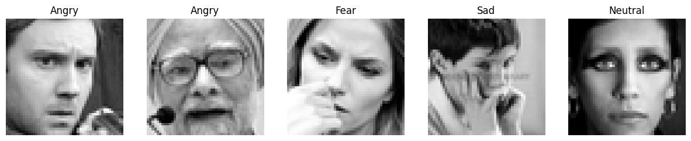
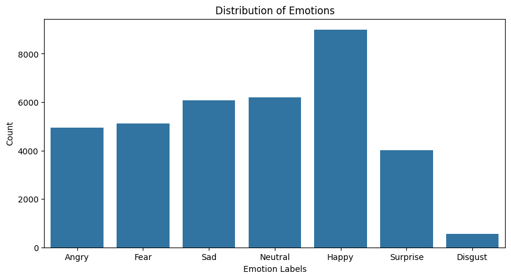

# Facial Expression Recognition (FER2013) — Kaggle Competition

## კონკურსის მიმოხილვა

კონკურსი: [Challenges in Representation Learning: Facial Expression Recognition Challenge](https://www.kaggle.com/competitions/challenges-in-representation-learning-facial-expression-recognition-challenge)

კონკურსი ეხება სახის ემოციების ამოცნობას სურათებზე დაყრდნობით. მონაცემთა ბაზაში თითოეული ჩანაწერი წარმოადგენს 48×48 პიქსელის ზომის შავ-თეთრ (grayscale) სურათს, რომელსაც მინიჭებული აქვს ერთ-ერთი 7 ემოციური კატეგორიიდან (Angry, Disgust, Fear, Happy, Sad, Surprise, Neutral). ანუ, ეს არის **მრავალკლასიანი კლასიფიკაციის პრობლემა (multi-class classification)**, 7 შესაძლო კლასით.



მონაცემები მოცემულია ერთ ცხრილში, სამი სვეტით:

| სვეტი | აღწერა |
|-------|--------|
| `emotion` | სამიზნე ცვლადი — მთელი რიცხვი 0-დან 6-მდე, შეესაბამება ემოციის კატეგორიას |
| ` pixels` | სურათის 48×48=2304 პიქსელის მნიშვნელობა, space-ით გამოყოფილი სტრინგის სახით |
| ` Usage` | მონაცემთა split-ის ნიშანი — `Training`, `PublicTest` ან `PrivateTest` |


მონაცემთა ბაზა საკმაოდ დაუბალანსებელია კლასების მიხედვით — Happy კლასი ყველაზე დომინანტურია (~25%), Disgust კი ყველაზე მცირერიცხოვანია.



---

## ჩემი მიდგომა

ვინაიდან ამოცანა წარმოადგენს სურათების კლასიფიკაციას, ბუნებრივი არჩევანი იყო Convolutional Neural Network (CNN) არქიტექტურები. დავიწყე ყველაზე მარტივი, ზედაპირული CNN-ით (Baseline), და თანდათან გავაღრმავე და დავამატე უფრო რთული კომპონენტები — Batch Normalization, Residual connections (ResNet) და, ბოლოს, თანამედროვე ConvNeXt არქიტექტურა.

თითოეული არქიტექტურისთვის გამოვიყენე შემდეგი მიდგომა:

1. **ჰიპერპარამეტრების ძებნა (grid search):** თითოეული კომბინაცია (`learning_rate`, `batch_size`) გავუშვი მხოლოდ **5 ეპოქაზე**, რათა სწრაფად მენახა, რომელი კონფიგურაცია იძლევა საუკეთესო ვალიდაციის სიზუსტეს.
2. **გაგრძელებული ტრენინგი:** საუკეთესო ვალიდაციის სიზუსტის მქონე კონფიგურაცია გავუშვი **30 ან 40 ეპოქაზე**, რათა მიმეღო თითოეული არქიტექტურის საუკეთესო მოდელი.

ყველა მოდელისთვის გამოვიყენე:
- **Loss function:** `CrossEntropyLoss`
- **Optimizer:** `Adam` 

ვინაიდან ჩავთვალე, რომ Adam საუკეთესო გრადიენტ დისენტს მომცემდა

---

## რეპოზიტორიის სტრუქტურა

```
├── model_experiment_baseline_cnn.ipynb
├── model_experiment_deep_baseline_cnn.ipynb
├── model_experiment_deep_batchnorm_cnn.ipynb
├── model_experiment_resnet_cnn.ipynb
├── model_experiment_ConvNeXt.ipynb
├── model_inference.ipynb
└── README.md
```

| ფაილი | აღწერა |
|-------|--------|
| `model_experiment_baseline_cnn.ipynb` | მონაცემთა ჩატვირთვის პაიპლაინი (`FERDataset`), მარტივი (საბაზო) CNN არქიტექტურა, hyperparameter grid search და საუკეთესო კონფიგურაციის გაგრძელებული ტრენინგი |
| `model_experiment_deep_baseline_cnn.ipynb` | Baseline CNN-ის უფრო ღრმა ვერსია, learning rate-ების შედარება |
| `model_experiment_deep_batchnorm_cnn.ipynb` | ღრმა CNN Batch Normalization ფენებით, grid search და გაგრძელებული ტრენინგი |
| `model_experiment_resnet_cnn.ipynb` | ResNet-ტიპის CNN, grid search, overfitting-ის ანალიზი და რეგულარიზაცია |
| `model_experiment_ConvNeXt.ipynb` | ConvNeXt-ზე დაფუძნებული მოდელი, grid search და გაგრძელებული ტრენინგი — **საუკეთესო მოდელი** |
| `model_inference.ipynb` | საუკეთესო (ConvNeXt) მოდელის ჩატვირთვა და inference ახალ სურათებზე |

---

## მონაცემთა დამუშავება

` pixels` სვეტში თითოეული სურათი მოცემულია 2304 (48×48) space-ით გამოყოფილი პიქსელის მნიშვნელობის სახით. ეს სტრინგი უნდა დავყო, გადავაკონვერტირო რიცხვებად, reshape გავუკეთო 48×48-ზე და დავუმატო channel განზომილება. ამის გარდა, პიქსელების მნიშვნელობები ნორმალიზებულია [0, 1] ინტერვალში, შემდეგ კი `transforms.Normalize((0.5,), (0.5,))`-ის მეშვეობით — [-1, 1]-ში.

Train/Validation split გაკეთებულია ` Usage` სვეტის მიხედვით — `Training` მონაცემები გამოყენებულია ტრენინგისთვის, ხოლო `PublicTest` — ვალიდაციისთვის.

> **შენიშვნა:** ზემოთ მოცემული `DataLoader`-ები გამოყენებულია საწყისი ჩატვირთვისთვის — ექსპერიმენტების დროს `batch_size` იცვლება grid search-ის შესაბამისად (32 ან 128).

---

## ტრენინგი

### ტესტირებული მოდელები

| მოდელი | ტიპი | მახასიათებელი                                                             |
|--------|------|---------------------------------------------------------------------------|
| Baseline CNN | CNN | მარტივი, ზედაპირული convolutional ქსელი — საწყისი წერტილი                 |
| Deep Baseline CNN | CNN | Baseline CNN-ის უფრო ღრმა ვერსია, მეტი convolutional ფენით                |
| Deep BatchNorm CNN | CNN + BatchNorm | ღრმა არქიტექტურა, Batch Normalization ფენებით ტრენინგის სტაბილიზაციისთვის |
| ResNet CNN | CNN + Residual connections | ResNet-ტიპის არქიტექტურა, ნარჩენი (residual) კავშირებით                   |
| ConvNeXt | Modern CNN (ConvNeXt) | თანამედროვე, transformer-ზე დაფუძნებული convolutional არქიტექტურა         |

---

### Baseline CNN

ეს არქიტექტურა წარმოადგენდა ჩემს საწყის წერტილს. გავუშვი სრული grid search — 10 კომბინაცია (`learning_rate` ∈ {0.01, 0.005, 0.001, 0.0005, 0.0001} × `batch_size` ∈ {32, 128}), თითოეული 5 ეპოქაზე.

**Grid search შედეგები (5 ეპოქა, 10 run):**

| run | train\_accuracy | train\_loss | val\_accuracy | val\_loss |
|-----|------------------|-------------|----------------|-----------|
| 1 | 25.13 | 1.8114 | 24.94 | 1.8114 |
| 2 | 25.13 | 1.8112 | 24.94 | 1.8118 |
| 3 | 55.17 | 1.1798 | 51.21 | 1.2651 |
| 4 | 58.17 | 1.1061 | 53.27 | 1.2271 |
| 5 | 46.26 | 1.4124 | 47.73 | 1.3876 |
| 6 | 25.13 | 1.8107 | 24.94 | 1.8096 |
| 7 | 45.41 | 1.3994 | 45.64 | 1.4064 |
| 8 | 58.39 | 1.1035 | **53.27** | 1.2274 |
| 9 | 52.62 | 1.2478 | 50.63 | 1.2808 |
| 10 | 42.19 | 1.5081 | 42.77 | 1.4735 |

სამ run-ში (1, 2, 6) მოდელი "გაიჭედა" — ტრენინგისა და ვალიდაციის სიზუსტე ორივესთვის ~25%-ია, ხოლო loss ~1.81. ეს მნიშვნელობა თითქმის ემთხვევა მხოლოდ ყველაზე ხშირი კლასის (Happy, ~25% მონაცემებში) ბრმად პროგნოზირებას — ანუ, ალბათ ყველაზე მაღალი learning rate-ის (`0.01`) კომბინაციებში, ოპტიმიზაცია ვერ გასცდა ამ ტრივიალურ ამონახსნს.

დანარჩენ 7 run-ში, ტრენინგისა და ვალიდაციის სიზუსტეები საკმაოდ ახლოს არის ერთმანეთთან (სხვაობა უმეტესად 5 პროცენტული პუნქტის ფარგლებშია) — ეს არ არის overfitting-ის ნიშანი, არამედ underfitting-ის: 

რაც ნიშნავს, რომ მოდელს საკმაოდ მაღალი ბაიესი აქვს.

საუკეთესო ვალიდაციის სიზუსტის (53.27%, run 8) კონფიგურაცია გავუშვი 30 ეპოქაზე:

**გაგრძელებული ტრენინგი (30 ეპოქა):**

| epoch | train\_accuracy | train\_loss | val\_accuracy | val\_loss |
|-------|------------------|-------------|----------------|-----------|
| 30 | 44.62 | 1.4200 | 42.83 | 1.4742 |

საინტერესოა, რომ 30 ეპოქის შემდეგ ვალიდაციის სიზუსტე *შემცირდა* 53.27%-დან 42.83%-მდე (ისევე, როგორც ტრენინგის სიზუსტე — 58.39%-დან 44.62%-მდე), თუმცა train/val სხვაობა მაინც მინიმალურია (~1.8 პუნქტი). 
ანუ overfitting აქ არ გვაქვს, მაგრამ მოდელი ვერც სტაბილურად სწავლობს უფრო ხანგრძლივ ტრენინგზე — შესაძლოა ამ learning rate-ზე ოპტიმიზაცია მერყეობდეს ლოკალური მინიმუმის გარშემო. 

ეს ნათლად აჩვენებს, რომ ეს მარტივი არქიტექტურა საკმარის კომპლექსურობას არ ფლობს ამ ამოცანისთვის, 
რამაც გადამაწყვეტინა, რომ გამომეცადა უფრო ღრმა არქიტექტურები.

**Baseline CNN საბოლოო შედეგები:**

| მეტრიკა | მნიშვნელობა |
|---------|-------------|
| val\_accuracy | 42.83 |
| val\_loss | 1.4742 |
| train\_accuracy | 44.62 |
| accuracy\_gap | 1.79 |

---

### Deep Baseline CNN

ეს არქიტექტურა წარმოადგენს Baseline CNN-ის უფრო ღრმა ვერსიას — მეტი convolutional ფენით, რათა მოდელს მეტი კომპლექსურობა ჰქონდეს. 
ამით ვიფიქრე, რომ ბაიესს შევამცირებდი, თუმცა ძალიან არ გაიზრდებოდა ვარიაცია 


ამ მოდელისთვის შევადარე ორი `learning_rate` მნიშვნელობა (`batch_size=32` ფიქსირებული), თითოეული 10 ეპოქაზე:

| batch\_size | learning\_rate | epoch | train\_accuracy | train\_loss | val\_accuracy | val\_loss |
|-------------|------------------|-------|------------------|-------------|----------------|-----------|
| 32 | 0.001 | 10 | 84.06 | 0.4497 | 55.50 | 1.6780 |
| 32 | 0.0001 | 10 | 84.26 | 0.4492 | **58.87** | 1.4180 |

ორივე კონფიგურაცია ტრენინგის მონაცემებზე აღწევს ~84% სიზუსტეს, თუმცა ვალიდაციაზე — მხოლოდ 55-59%-ს. 
ეს ~26-29 პროცენტიანი სხვაობა უკვე ნათელი overfitting-ია — Baseline CNN-ისგან განსხვავებით (სხვაობა 1.79 პუნქტი), 
დამატებულმა კომპლექსურობამ მოდელს მისცა საშუალება ზედმეტად კარგად ესწავლა ტრენინგის მონაცემები.

შედეგები გვიჩვენებს, რომ ჩემი იმედები არ გამართლდა. ვარიაცია ზედმეტად გაიზარდა. 

`learning_rate=0.0001`-მა ოდნავ უკეთესად განზოგადა (58.87% vs 55.50%) და შეირჩა, როგორც Deep Baseline CNN-ის საუკეთესო კონფიგურაცია. 
Baseline CNN-თან შედარებით (val\_accuracy 42.83%), 
სიღრმის გაზრდამ ვალიდაციის სიზუსტე 16 პუნქტით გააუმჯობესა — თუმცა overfitting-ის ხარჯზე.

**Deep Baseline CNN საბოლოო შედეგები:**

| მეტრიკა | მნიშვნელობა |
|---------|-------------|
| val\_accuracy | **58.87** |
| val\_loss | 1.4180 |
| train\_accuracy | 84.26 |
| accuracy\_gap | 25.39 |

---


### Deep BatchNorm CNN

ვინაიდან Deep Baseline მოდელმა იმედები გამიცრუა და ზედმეტად გაზარდა ვარიაცია, მივიღე გადაწყვეტილება, რომ გამომეყენებინა
რეგულარიზაციის მექანიზმები, რითაც მნიშვნელოვნად შევამცირებდი ვარიაციას, ბაიესის ოდნავ გაზრდის ხარჯზე, ანუ მოდელი უკეთესად
განზოგადდებოდა არაუნახავ მონაცემებზე, იმის ხარჯზე, რომ ოდნავ შემცირდებოდა კომპლექსურობის დაჭერის შესაძლებლობა. 

მოკლედ, ამ არქიტექტურაში Deep Baseline CNN-ს ემატება Batch Normalization ფენები, 
რათა დავაკვირდე, როგორ მოქმედებს ეს ტრენინგის სტაბილურობასა და overfitting-ზე.

**Grid search შედეგები (5 ეპოქა):**

| batch\_size | learning\_rate | epoch | train\_accuracy | train\_loss | val\_accuracy | val\_loss |
|-------------|------------------|-------|------------------|-------------|----------------|-----------|
| 32 | 0.001 | 5 | 43.51 | 1.4133 | 48.57 | 1.3261 |
| 32 | 0.0005 | 5 | 49.97 | 1.2801 | **53.44** | 1.2087 |
| 32 | 0.0001 | 5 | 55.07 | 1.1871 | 53.27 | 1.2079 |
| 128 | 0.001 | 5 | 44.22 | 1.4249 | 45.42 | 1.3616 |
| 128 | 0.0005 | 5 | 50.72 | 1.2875 | 50.13 | 1.2976 |
| 128 | 0.0001 | 5 | 54.46 | 1.2011 | 51.49 | 1.2481 |

საუკეთესო კონფიგურაცია (`batch_size=32`, `learning_rate=0.0005`, val\_accuracy=53.44%) გავუშვი 30 ეპოქაზე:

**გაგრძელებული ტრენინგი (30 ეპოქა):**

| batch\_size | learning\_rate | epoch | train\_accuracy | train\_loss | val\_accuracy | val\_loss |
|-------------|------------------|-------|------------------|-------------|----------------|-----------|
| 32 | 0.0005 | 30 | 79.93 | 0.5049 | **58.04** | 1.7264 |

30 ეპოქის შემდეგ ვალიდაციის სიზუსტე გაუმჯობესდა 53.44%-დან 58.04%-მდე (+4.6 პუნქტი), 
თუმცა ტრენინგის სიზუსტე გაიზარდა გაცილებით მეტად — 49.97%-დან 79.93%-მდე (+30 პუნქტი). 
შედეგად, train/val სხვაობა ~22 პუნქტამდე გაიხსნა — ეს უკვე მნიშვნელოვანი overfitting-ია, Deep Baseline CNN-ის (25.39) მსგავსი მასშტაბის. 
ანუ, Batch Normalization-მა გააუმჯობესა საწყისი ტრენინგის სტაბილურობა და შეამცირა ვარიაცია, თუმცა არა იმდენად რომ ვთქვათ, მოდელი
კარგად ზოგადდება უნახავ მონაცემებზე. 21% - იანი სხვაობას ტრენინგისა და ვალიდაციის სიზუსტეებს შორის, მაინც overfitting - ად
ვთვლი.

**Deep BatchNorm CNN საბოლოო შედეგები:**

| მეტრიკა | მნიშვნელობა |
|---------|-------------|
| val\_accuracy | 58.04 |
| val\_loss | 1.7264 |
| train\_accuracy | 79.93 |
| accuracy\_gap | 21.89 |

---

### ResNet CNN

ვინაიდან სტანდარტულმა კონვოლუციურმა ქსელებმა იმედები გამიცრუა, გადავწყვიტე გადავსულიყავი უფრო კომპლექსურ არქიტექტურებზე.

ეს არქიტექტურა იყენებს residual (ნარჩენ) კავშირებს — და ეს არის არქიტექტურა, რომელმაც **ყველაზე მკაფიოდ** აჩვენა overfitting
ამ დავალებაში.

**Grid search შედეგები (5 ეპოქა):**

| batch\_size | learning\_rate | epoch | train\_accuracy | train\_loss | val\_accuracy | val\_loss |
|-------------|------------------|-------|------------------|-------------|----------------|-----------|
| 32 | 0.001 | 5 | 60.63 | 1.0402 | 57.51 | 1.1383 |
| 32 | 0.0005 | 5 | 62.18 | 1.0068 | 47.39 | 1.4451 |
| 32 | 0.0001 | 5 | 68.10 | 0.8677 | **57.90** | 1.1601 |
| 128 | 0.001 | 5 | 61.41 | 1.0285 | 56.76 | 1.1892 |
| 128 | 0.0005 | 5 | 64.60 | 0.9509 | 56.23 | 1.2162 |
| 128 | 0.0001 | 5 | 68.37 | 0.8759 | 53.86 | 1.3103 |

საუკეთესო კონფიგურაცია (`batch_size=32`, `learning_rate=0.0001`, val\_accuracy=57.90%) გავუშვი 30 ეპოქაზე — **რეგულარიზაციის გარეშე**:

**best-resnet-cnn (რეგულარიზაციის გარეშე, 30 ეპოქა):**

| batch\_size | learning\_rate | epoch | train\_accuracy | train\_loss | val\_accuracy | val\_loss |
|-------------|------------------|-------|------------------|-------------|----------------|-----------|
| 32 | 0.0001 | 30 | 98.45 | 0.0604 | 52.02 | 2.8756 |

ეს არის ამ დავალებაში ყველაზე მკაფიო overfitting-ის შემთხვევა. 

ტრენინგის სიზუსტემ მიაღწია 98.45%-ს (loss-ით 0.0604 — მოდელმა პრაქტიკულად დაიზეპირა ტრენინგის მონაცემები), 
მაშინ როცა ვალიდაციის სიზუსტემ *დაიკლო* 57.90%-დან 52.02%-მდე, ხოლო val\_loss 2.8756-მდე გაიზარდა — 
ეს ბევრად აღემატება ამ დავალებაში ნახულ ნებისმიერ სხვა val\_loss-ს. 

train/val სხვაობა — **46.43%** — ყველაზე დიდია ამ პროექტში. ანუ residual connections-მა მისცა მოდელს იმდენი კომპლექსურობა, 
რომ 30 ეპოქაზე სრულად მოერგო ტრენინგის მონაცემებს.

ანუ მოდელმა აჩვენა საკმაოდ მაღალი ვარიაცია, და დაბალი ბაიესი. 

ამის გამოსასწორებლად დავამატე **რეგულარიზაცია** და გავუშვი მოდელი ხელახლა, იმავე `batch_size`/`learning_rate`-ით, 30 ეპოქაზე.

ვიფიქრე, რომ ძლიერი რეგულარიზაცია მნიშვნელოვნად შეამცირებდა ვარიაციას, ბაიესის ოდნავ შემცირების ხარჯზე და მართლაც,
ამ მოქმედებამ შედეგი გამოიღო:

**best-regularized-resnet-cnn (რეგულარიზაციით, 30 ეპოქა):**

| batch\_size | learning\_rate | epoch | train\_accuracy | train\_loss | val\_accuracy | val\_loss |
|-------------|------------------|-------|------------------|-------------|----------------|-----------|
| 32 | 0.0001 | 30 | 62.52 | 1.0338 | **60.10** | 1.0643 |

შედეგი მკვეთრად გაუმჯობესდა: ტრენინგის სიზუსტე დაეცა 98.45%-დან 62.52%-მდე (-35.9 პუნქტი) — 
მოდელს აღარ შეუძლია ტრენინგის მონაცემების დაზეპირება — 
მაგრამ ვალიდაციის სიზუსტე გაიზარდა 52.02%-დან 60.10%-მდე (+8.1%). 
train/val სხვაობა შემცირდა 46.43-დან 2.42 პუნქტამდე — overfitting აღარ გვაქვს.

ეს არის Variance-Bias Tradeoff-ის ნათელი მაგალითი: 
რეგულარიზაციამ ოდნავ გაზარდა Bias (მოდელი ვეღარ იზეპირებს ტრენინგის მონაცემებს), 
მაგრამ მნიშვნელოვნად შემცირა Variance, რამაც მოდელს მისცა შესაძლებლობა, რომ კარგად განზოგადებულიყო უნახავ მონაცემებზე. 

შედეგად, val\_accuracy=60.10%-ით, რეგულარიზებული ResNet გახდა **ამ პროექტში მეორე საუკეთესო მოდელი** (ConvNeXt-ის შემდეგ).

(ამიტომ ჯობია გააზრება დაზეპირებას დდ)

**ResNet CNN საბოლოო შედეგები(მაღალი ვარიაციის და დაბალი ვარიაციის მქონე მოდელების შედარება):**

| მეტრიკა | best-resnet-cnn | best-regularized-resnet-cnn |
|---------|-------------------|------------------------------|
| train\_accuracy | 98.45 | 62.52 |
| val\_accuracy | 52.02 | **60.10** |
| train\_loss | 0.0604 | 1.0338 |
| val\_loss | 2.8756 | 1.0643 |
| accuracy\_gap | 46.43 | 2.42 |

---

### ConvNeXt

სასურველი შედეგი უკვე დავდე, თუმცა ვინაიდან ტრანსფორმერების არქიტექტურული მოდელები ძალიან პოპულარული გახდა, გადავწყვიტე
მეც მეცადა ბედი, კერძოდ, დამეტრენინგებინა ისეთი მოდელი, რომელიც ტრანსფორმერის არქიტექტურის ბიძაშვილი იყო.

თუმცა მნიშვნელოვანია გავითვალისწინოთ, რომ ConvNeXt არის სუფთა კონვოლუციური ნეირონული ქსელი, მას არ აქვს attention 
მექანიზმი, რომელიც ტრანსფორმერის არქიტექტურას ახასიათებს, არამედ ამ არქიტექტურაში გამოყენებულია ტრანსფორმერის არქიტექტურისთვის
დამახასიათებელი იდეები.


**Grid search შედეგები (5 ეპოქა):**

| batch\_size | learning\_rate | epoch | train\_accuracy | train\_loss | val\_accuracy | val\_loss |
|-------------|------------------|-------|------------------|-------------|----------------|-----------|
| 32 | 0.0005 | 5 | 53.96 | 1.2211 | **54.22** | 1.1995 |
| 32 | 0.001 | 5 | 42.09 | 1.4910 | 44.33 | 1.4208 |

საუკეთესო კონფიგურაცია (`batch_size=32`, `learning_rate=0.0005`, val\_accuracy=54.22%) გავუშვი 40 ეპოქაზე:

**გაგრძელებული ტრენინგი (40 ეპოქა):**

| run | batch\_size | learning\_rate | epoch | train\_accuracy | train\_loss | val\_accuracy | val\_loss |
|-----|-------------|------------------|-------|------------------|-------------|----------------|-----------|
| best-ConvNeXt-cnn | 32 | 0.0005 | 40 | 75.98 | 0.6578 | **64.53** | 1.0673 |

40 ეპოქის შემდეგ ვალიდაციის სიზუსტემ 54.22%-დან 64.53%-მდე გაიზარდა — ეს არის ამ პროექტში **საუკეთესო შედეგი**. 
ტრენინგის სიზუსტემ მიაღწია 75.98%-ს, რამაც გამოიღო ~11.45% train/val სხვაობა — ეს არის overfitting, 
და მიუხედავად ვალიდაციაზე სიზუსტის მაღალი შედეგისა, მოდელმა overfitting - ის ამ მაჩვენებლის გამო ვერ დადო ტესტზე 
კარგი შედეგი.

ვინაიდან ეს მოდელი overfit - ში წავიდა, ამიტომ გადავწყვიტე კიდევ ერთი ConvNeXt - ის ტრენინგი ძლიერი რეგულარიზაციით,
რის შედეგადაც მივიღე კიდევ უფრო უკეთესი ვალიდაციის სქორი და ამავდროულად მოდელი არ წავიდა overfit - ში, ამიტომ 
საბოლოოდ ავარჩიე ეს მოდელი, როგორც საუკეთესო.  

**ConvNeXt საბოლოო შედეგები:**

| მეტრიკა | მნიშვნელობა |
|---------|-------------|
| val\_accuracy | **66.00**   |
| val\_loss | 1.3417      |
| train\_accuracy | 69.15       |
| accuracy\_gap | 3.15        |

---

### საბოლოო მოდელის შერჩევა

| მოდელი | val\_accuracy | train\_accuracy | accuracy\_gap |
|--------|---------------|-----------------|---------------|
| **ConvNeXt** | **66.00**     | 69.15           | 3.15          |
| ResNet CNN (რეგულარიზებული) | 60.10         | 62.52           | 2.42          |
| Deep Baseline CNN | 58.87         | 84.26           | 25.39         |
| Deep BatchNorm CNN | 58.04         | 79.93           | 21.89         |
| ResNet CNN (რეგულარიზაციის გარეშე) | 52.02         | 98.45           | 46.43         |
| Baseline CNN | 42.83         | 44.62           | 1.79          |

**ConvNeXt** შეირჩა საბოლოო მოდელად — მან მიაღწია ყველაზე მაღალ ვალიდაციის სიზუსტეს (66%) ყველა მოდელს შორის.


ამ საუკეთესო ConvNeXt მოდელისთვის დავწერე პაიპლაინის კოდი და დავლოგე WandB - ზე, რათა ჩამომეტვირთა model inference - ში.

`model_inference.ipynb`-ში ჩატვირთულია ეს საბოლოო ConvNeXt მოდელი.

---

## ექსპერიმენტების ტრეკინგი

ექსპერიმენტების ლოგირებისთვის გამოვიყენე **Weights & Biases (wandb)**, ხოლო კოდის ვერსიების მართვისთვის — **GitHub**.

თითოეული WandB run შეესაბამება ერთი მოდელის ერთ კონკრეტულ ვერსიას.


**ჩაწერილი მეტრიკები:**

| მეტრიკა | აღწერა |
|---------|--------|
| `epoch` | ეპოქის ნომერი |
| `train_accuracy` / `train_loss` | სიზუსტე და loss ტრენინგის მონაცემებზე |
| `val_accuracy` / `val_loss` | სიზუსტე და loss ვალიდაციის (`PublicTest`) მონაცემებზე |
| `_runtime` | run-ის ხანგრძლივობა |
